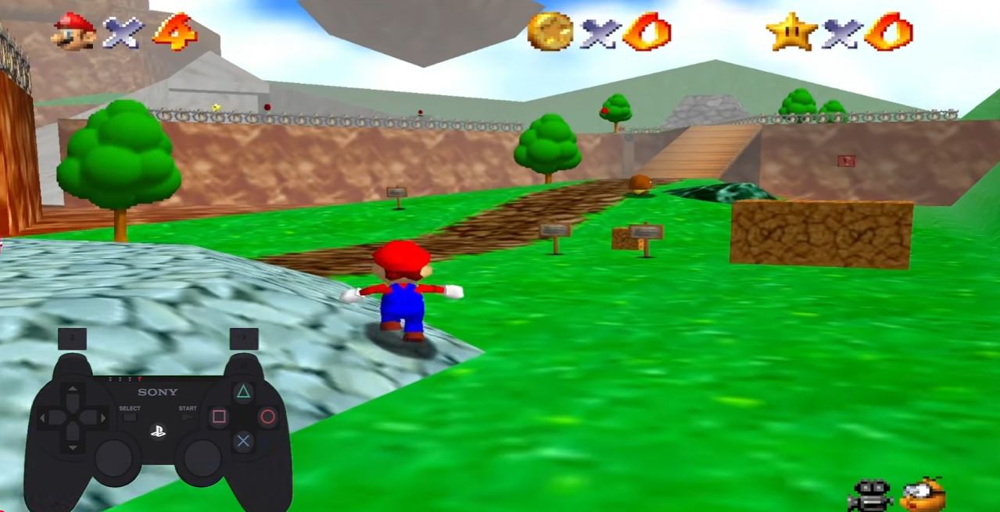
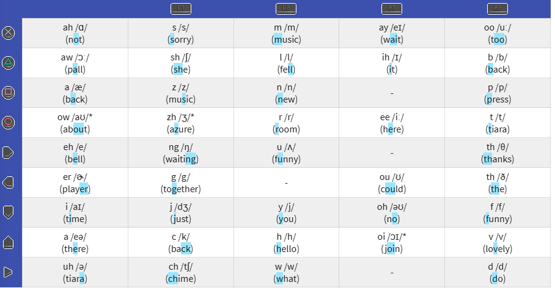

# Player 2

## Overview

| | |
|---|---|
| **Event** | boroCTF 2026 |
| **Category** | Crypto |
| **Points** | 300 |
| **Author** | Franklin & nulled |

!!! info "Challenge Description"
    https://www.youtube.com/watch?v=dthKN5GNPOU

    Flag Format: boroCTF{flag} Note - No _ between words

    NOTE: THIS IS A CRYPTO CHALLENGE, THERE IS NOTHING TO DO WITH YOUTUBE OR VIDEO FORENSICS

## Recon

{ .cc-img }

The video looks like ordinary **Super Mario 64** gameplay (with *Mushroom Kingdom* music), but two things are off:

1. There is a controller overlay showing live button presses.
2. The overlay is a PlayStation controller, not an N64 controller.

SM64 is a Nintendo game, not designed for PlayStation, so the controller is deliberately wrong. As stated in the description, this challenge has nothing to do with YouTube or video forensics. I checked the file, channel and description first out of habit and found nothing, so the video is only a carrier for the inputs.

The only thing carrying meaningful information is the sequence of button presses, plus some occasional glitches in the game video and audio.
I felt these glitches were important as they were obviously intentional but I could figure out the meaning in my final solution (read after the flag for the authors much more straightforward intended pathway below). 

These inputs don't drive Mario (they aren't linked to the gameplay), and they arrive in bursts separated by either long or short pauses. I needed to treat this input stream as an encoded message, accounting for the pauses, and work out whether each group mapped to a letter or a word.

## Solution

### 1. Parsing the stream into units

First I logged each controller input using this notation:

```text
D-Pad:            U, D, L, R
Shapes:           O, X, Sq, Tr
Start:            St
Shoulder buttons: L1, L2, R1, R2
```

Then I transcribed the whole stream, breaking it into groups on the pauses. The gaps came in two sizes, so I put each long-pause group on its own line and marked the short pauses inside a group with ` / ` (I worked out what the two lengths meant later; at this stage it was just raw timing):

```text
 1:  R2 Tr R1 Tr L2 D U L2 Sq R2 St  /  L2 U R2 X
 2:  St R2 D  /  L1 D Tr L2 O L1 X
 3:  L2 O U R2 O
 4:  L2 St L2 L L2 Sq
 5:  L1 St L L1 D
 6:  R2 O R1 X L1 D  /  R1 Tr R2 O
 7:  R2 U R1 X L2 Tr L2 U R
 8:  L1 D L L2 O
 9:  R1 U R2 D R  /  R2 R D L2 O
10:  L2 Sq R1 U
11:  R2 O U L2 X
12:  L2 O St L1 X R1 O R2 D
13:  R1 U L2 Tr R2 St
14:  L2 Tr U R2 D
15:  L2 Tr L R2 U R2 O
16:  R1 O R2 D R1 Tr L2 Sq
17:  R2 St L R2 L
18:  R1 Tr L2 Sq L1 X U R2 St
19:  L2 Sq L L1 D L1 X R2 O
20:  R2 Sq Tr L1 Sq
21:  St L2 Sq R2 St R  /  R2 R D L2 O
22:  R2 L Sq L2 Sq L1 D L1 X
23:  L1 X R2 O X R2 Sq
```

Looking at the raw stream, I noticed a pattern in how the buttons fell. The four shoulder buttons (`L1 L2 R1 R2`) never appeared on their own, never ended a group, and never came back to back. Every shoulder press was immediately followed by one of the face buttons (a shape, a D-pad direction or Start), so the shoulders weren't symbols in their own right. They were **prefixes** that modified the button after them.

So I read the stream like this: a shoulder binds to the **next** face button to make one unit, and any face button (`X O Tr Sq U D L R St`) with no shoulder in front of it is a unit on its own. Since shoulders can't stand alone or chain, the split was unambiguous:

```text
L2 U  R2 X   ->   [L2+U] [R2+X]   ->   2 units
```

The pairing was nearly alternating but not a strict rule, since some units were bare face buttons. The prefix rule handled both cases.

### 2. Working out the cipher

My first guess was a straight substitution, one unit per letter. To test it I counted how many distinct units the scheme could produce: 9 face buttons, each either bare or carrying one of 4 shoulder prefixes.

```text
9 face buttons x 5 states (none/L1/L2/R1/R2) = 45 addressable units
```

That was more than 26, so one-unit-per-letter was out. From there I worked through a few candidate schemes, and the ones that didn't pan out were as informative as the one that did:

- **Grid / coordinate cipher.** A modifier-times-button structure looks exactly like a Polybius square or tap code: the shoulder picks a row, the face button picks a column, and the cell holds a character. That instinct is basically correct, since the system really is a row/column lookup table (it's the table in step 4). What it doesn't give you is a self-contained solve. The cells aren't a key you can recover by frequency analysis (a couple of dozen short words is nowhere near enough ciphertext to pin down a ~45-cell mapping); they're filled from an external dictionary. So the grid idea correctly points at the table shape, but you still need the published key, not cryptanalysis.
- **Japanese kana / romaji.** 45 is close to the 46-sound gojūon, and Mario is a Japanese game, so for a moment I thought each unit might be a kana that transliterates into a romaji answer. Worth a look, but it didn't go anywhere. That being said, SM64 isn't made for a playstaion controller.
- **English phonemes.** 45 also matches the English phoneme inventory (44 sounds) almost exactly.

This made the last too options viable, mapping each input unit to sounds. This could mean that each sequence of inputs would map to a word.

### 3. Identifying the system: Player 2 -> P2

I needed to find a system that maps PlayStation controller inputs to sounds. For a while, searches where fruitless but eventually I started included the title of the challenge: **Player 2**. 

Searching **"player 2 controller phonetics"** lead me to the Petscop Wiki's page for the **P2 to Talk** system which matched my needs.[^petscop] This tracks because Player 2 is denoted as P2 all the time.

Searching **"P2 to Talk"** landed me on the Giftscop lookup tool.[^giftscop] This confirmed my theory that each unit maps to a **phoneme**, and each phoneme string results in an English word.

### 4. The phoneme table

I used the phenome table on the Giftscop P2 to Talk page to map my inputs to sounds.[^giftscop]

{ .cc-img }

Decoding the first group, `R2,Tr-R1,Tr-L2,D-U-L2,Sq-R2,St`, gave `b . ih . h . i . n . d` -> **"Behind"**, and the next gave **"You"**. That was coherent English, so I knew I was on the right track.

### 5. The pauses come in two lengths

Initially I didn't think it mattered that some breaks were long and some short. Once I started decoding I realised the difference set the structure:

- A **long pause** ends a **sequence**.
- A **short pause** separates **words inside the same sequence**.

That meant a single sequence could hold more than one word, which later explained the extra letters I kept tripping over. Respecting both pause lengths, the full decode came out as 23 sequences:

| # | Inputs ( `/` = short pause ) | Phonemes | Word(s) | Note |
|---|---|---|---|---|
| 1 | R2,Tr-R1,Tr-L2,D-U-L2,Sq-R2,St / L2,U-R2,X | B-Ih-H-I-N-D / Y-Oo | Behind You | |
| 2 | St-R2,D / L1,D-Tr-L2,O-L1,X | Uh-V / Ck-Aw-R-S | Of Course | glitch |
| 3 | L2,O-U-R2,O | R-I-T | Right* | *homophone |
| 4 | L2,St-L2,L-L2,Sq | W-U-N | One | |
| 5 | L1,St-L-L1,D | Ch-E-Ck | Check | glitch |
| 6 | R2,O-R1,X-L1,D / R1,Tr-R2,O | T-Ay-Ck / Ih-T | Take It | |
| 7 | R2,U-R1,X-L2,Tr-L2,U-R | F-Ay-L-Y-er | Failure | glitch |
| 8 | L1,D-L-L2,O | Ck-E-R | Care | |
| 9 | R1,U-R2,D-R / R2,R-D-L2,O | O-V-Er / Th-E-R | Over There | |
| 10 | L2,Sq-R1,U | N-o | No | glitch |
| 11 | R2,O-U-L2,X | T-I-M | Time | |
| 12 | L2,O-St-L1,X-R1,O-R2,D | R-Uh-S-Ee-V | Receive | |
| 13 | R1,U-L2,Tr-R2,St | Oh-L-D | Old | |
| 14 | L2,Tr-U-R2,D | L-I-V | Live | glitch |
| 15 | L2,Tr-L-R2,U-R2,O | L-Eh-F-T | Left | |
| 16 | R1,O-R2,D-R1,Tr-L2,Sq | Ee-V-Ih-N | Even | |
| 17 | R2,St-L-R2,L | D-Eh-Th | Death | glitch |
| 18 | R1,Tr-L2,Sq-L1,X-U-R2,St | Ih-N-S-I-D | Inside | |
| 19 | L2,Sq-L-L1,D-L1,X-R2,O | N-Eh-Ck-S-T | Next | |
| 20 | R2,Sq-Tr-L1,Sq | P-Aw-Z | Pause | glitch |
| 21 | St-L2,Sq-R2,St-R / R2,R-D-L2,O | Uh-N-D-Er / Th-E-R | Under There | |
| 22 | R2,L-Sq-L2,Sq-L1,D-L1,X | Th-A-N-Ck-S | Thanks | |
| 23 | L1,X-R2,O-X-R2,Sq | S-T-O-P | Stop | |

Funnily, in the video some of the wording seems to match the gameplay. Mario turns around after **"Behind You"**. But this didn't help the solve

### 6. Reading the acrostic

Joining all the decoded words into a sentence gave a long run of plain English, nothing flag-shaped, and the flag had to be `boroCTF{...}` and reasonably short. So the words themselves weren't the message but I could see that each word sequence stood for a single letter, an acrostic. 


The flag had to start with the prefix **B, O, R, O, C, T, F**. Checking the first letter of each:

```text
1  Behind You    B
2  Of Course     O
3  Right         R
4  One           O
5  Check         C
6  Take It       T
7  Failure       F     ->  BOROCTF
```

That confirmed everything the final answer was an acrostic with each input sequence mapping to a word resulting in a letter.

Carrying on through the rest:

```text
 8  Care          C
 9  Over There    O    ("There" follows a short pause, so it doesn't add a letter)
10  No            N
11  Time          T
12  Receive       R
13  Old           O
14  Live          L
15  Left          L
16  Even          E
17  Death         D    ->  CONTROLLED
18  Inside        I
19  Next          N
20  Pause         P
21  Under There   U    ("There" follows a short pause, so it doesn't add a letter)
22  Thanks        T
23  Stop          S    ->  INPUTS
```

Read end to end: `BOROCTF` + `CONTROLLED INPUTS`. Each sequence decodes to a word, but the word is only a carrier; its first letter is the payload.

This is where the two pause lengths earned their keep. "Behind You", "Of Course", "Take It", "Over There" and "Under There" are each a single sequence, because a short pause binds the second word to the first. If you mistake a short pause for a long one you split "Over There" into two sequences and pull a stray `T` from "There", which is exactly the extra letter I kept getting before I trusted the timing. Take the first letter of each *sequence* and it comes out clean: twenty-three sequences, twenty-three letters, nothing left over.

The decoded phrase is the punchline too: every press in the video was scripted. Controlled inputs.

## Flag

!!! success "Flag"
    ```text
    boroCTF{controlled inputs}
    ```

## Post Addendum - What the glitches were actually for

Instead of using cryptanalysis to find P2 to Talk, the glitches were actually indicators all along. The challenge author **Franklin** read through this writeup and confirmed that most people wouldn't recognise petscop and thats where the glitches come into play.

Each glitch is followed by Mario moving in the shape of a letter. I went back and verified that and sure enough Mario spelled out **P E T S C O P**.  Searching **"player 2 petscop controller"** or **"player 2 petscop inputs"** turns up this very writeup quickly, since both the challenge's own internal logic and its name point at the same term from two different directions. This would've allowed me to breeze through steps 2 and 3 and quickly identify the system.

## Notes

- Most of the difficulty in this challenge was identifying what type of system would lead me to my answer. Once I knew it was **P2 to TALK** the rest is easy. This part would've been clear if I picked up on the glitches intended meaning.
- Without reading into the possibilities and clues of the outcomes, I would've wasted a lot of time on dead-ends. Recognising how the input combinations group together, the possibilities that it could map to and the flag length / prefix requirements all made 
this possible to identify that a phonetic cipher was possible.
- I possibly could have solved this much quicker if I had connected "Player 2" = P2 on my own.
- Knowing the answer starts with `boroctf` let me confirm that I was on the right track. 
- Homophones could've caused issues as words are phonetic. Sequence 3 (`R-I-T`, /raɪt/) could be right, rite or wright. This means that line could've started with either R or W
- The two easiest tells, both readable straight off the input stream with no prior knowledge, were the **shoulder prefix rule** and the **pause distinctions** between inputs.

## References

[^petscop]: P2 to TALK, Petscop Wiki: https://petscop.fandom.com/wiki/P2_to_TALK
[^giftscop]: P2 to TALK info and lookup tool (Giftscop): https://giftscop.com/etc/p2_to_talk