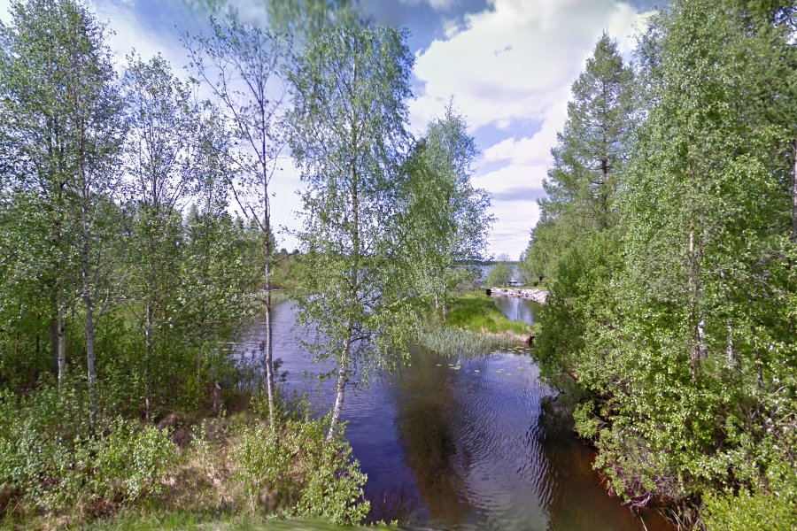
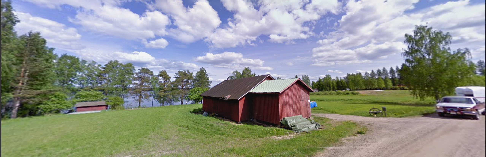
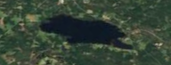
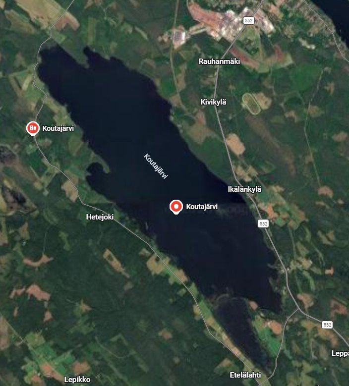
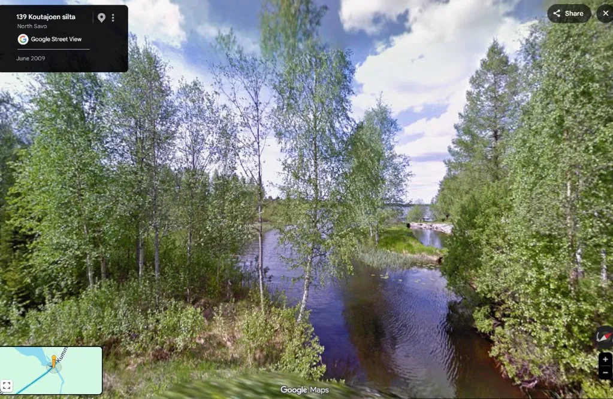
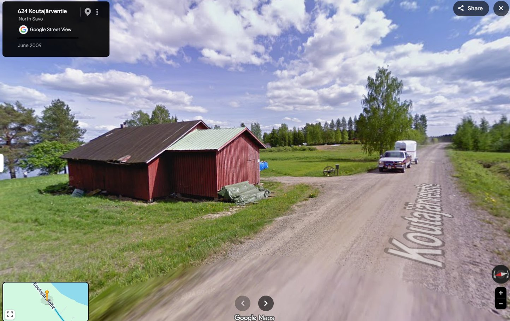

# Lake of Doom

## Overview

| | |
|---|---|
| **Event** | boroCTF 2026 |
| **Category** | OSINT / GEOINT |
| **Points** | 200 |
| **Author** | ForeverFlames |

!!! info "Challenge Description"
    What a beautiful lake. I wish I had fins. I want swim now. Find lake name

    Flag Format: boroCTF{lake_name}

This one came out in three drops rather than all at once. We got a single image to start, then after no solves, a second image arrived, then a third a few hours after that. I've written this up how we could tell from each image as it landed, then how the flag actually came together, then a look at how the author meant for it to be solved in the first place.

## Stage 1: the original image

The flag is the name of the lake pictured. The image description "I wish I had fins" points directly to Finland. This would be a great find except I would quickly learn that Finland has the highest density of lakes relative to its size.

{ .cc-img }

Originally, this picture of the lake was the only handout. There is no EXIF, filename hints or forensic clues. There are still some helpful context clues here. Theoretically, the challenge was designed to be solvable from just this.

The image shows a narrow curved portion of the lake that expands into a wider body of water.

I was super confident the framing felt like Google Street View as it was taken from an elevated, wide field of view with some foliage blur. This meant the lake was right next to a road with street view coverage or likely went under the road. This meant, I could validate any finding through Street View. This could also be some foreshadowing that reversing for someone's personal photos would be fruitless.

The surrounding birch trees and terrain would lead to Finland and Sweden both being reasonable guesses. This combined with the "fins" hint validated it was Finland for me. Unfortunately, Finland has 188,000 lakes.

Here's what I have to work with:
- Finland
- General lake shape and surrounding terrain
- Road against or particular over narrow part of lake
- Streetviewable Road

I chased a lot of dead ends here. This including a bunch of attempts at reversing and also a long hunt for literal "lakes of despair" in Finland. This turned up the Bodom murder lake and a few grimly translating lakes, none of which matched my criteria or were correct.

None of that is a knock on the clues themselves. Finland simply has an
enormous number of lakes for its size, so "a birch-lined waterway in Finland,
roughly this shape" wasn't a unique enough fingerprint yet. Two days in,
nobody had cracked it from this image alone, which was as much a reflection
of how many candidates that left on the table as anything else.

## Stage 2: the cabin photo

{ .cc-img }

The second image landed after a couple days with no solves.

This one was also identifiably a streetview photo with a blurred license plate and a **2024 Google** watermark visible.

Finland has no shortage of waterside cabins on dirt roads, across most regions so this did not filter my search size down but it did give us another concrete anchor point with some open land nearby. This gave a marginally better sense of scale and how developed the shoreline area was. The 2024 capture date also gave us a sense of how recent the imagery was.

Searching these context clues including where most of Googles 2024 mapping was in Finland, did not lead to the correct final answer.

## Stage 3: the satellite shape

{ .cc-img }

A few hours after the cabin photo, the third and final image dropped a
small blurry satellite crop showing the lake's outline from directly overhead.

This allowed us to see the lakes shape, scale and nearby terrain. Comparing this to our original picture, I would guess that it was located from the right-most part of the lake looking in.

Now I had to find a lake with this shape, size, nearby roads and surroundings. At this stage, I could filter out tiny ponds and focus on larger *järvi*-sized lakes.

I built an OverpassTurbo query that searched for Finland lakes within this size range, within 10m to roads. I wanted to see if there was a way to cross reference this to only 2024 streetview roads but that path wasn't possible.

The original query was too large for overpass to handle so I limited it to **Järvi-Suomi**, the Finnish lakeland region.

```txt
[out:json][timeout:180];

(
  way["natural"="water"]["water"="lake"](61.0,25.5,63.5,30.5);
  way["natural"="water"]["water"="lake_basin"](61.0,25.5,63.5,30.5);
  relation["natural"="water"]["water"="lake"](61.0,25.5,63.5,30.5);
)->.lakes;

way(around.lakes:10)["highway"]->.nearbyRoads;

.lakes out geom;
.nearbyRoads out geom;
```

I intended to filter this down further with Python but the query did not work as planned and I had to take a break from this challenge.

## Solution

The credit for actually landing the flag here goes to my WHFB teammate **DM**.

They were able to use the satellite image itself to lock down the region to central and eastern Finland.

From there they pulled lake lists by region, starting with Keski-Suomi and
its neighbouring regions. They filtered down the thousands of named lakes down to just a list of proper *järvi*-sized lakes.

Sweeping what was left against the shape image came back with **Koutajärvi**.

Everything after that was confirmation. The satellite view and both Street View Images match all provided images. Doom and Despair over. This was the last challenge we solved for this event before it completed.

{ .cc-img }

{ .cc-img }

{ .cc-img }

## Flag

!!! success "Flag"
    ```text
    boroCTF{Koutajärvi}
    ```

## How it was meant to be solved

After the event I reached out to the author, **ForeverFlames**, mostly out
of curiosity about how the intended solve from the first image was supposed to work. They were happy to walk through it, and were refreshingly candid that
the challenge ended up tougher than planned.

The intended chain was almost exactly what we worked out in stage one: "I
wish I had fins" was meant to confirm Finland. The abundance of birch trees were meant to lead us to central Finland and from there we could use the slight view of the lake shape to identify the body of water. However, they did not fully account for how lakey Finland was. Picking out one lake by eye from a huge field of similar lakes was a bigger ask than intended.

Every link in the planned chain was sound, it just ran into the problem of the sheer scale of Finland's lake count.

It made for a genuinely satisfying challenge to chip away at across its full
release window, and there's something fun about a brute-force regional sweep
landing cleanly on the right lake once it finally had enough to work with.

## Notes

- Wordplay or homophone hints buried in a challenge description ("fins" for
  Finland) are cheap to test early and can save a lot of wandering, so it's
  worth giving them a serious look before assuming they're just flavour.