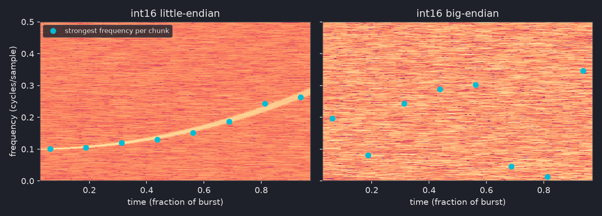
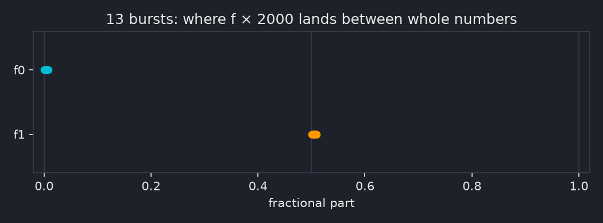

# Orthogonal Singularity

## Overview

| | |
|---|---|
| **Event** | CSS CTF 2026: Return of Nexus |
| **Category** | Misc |
| **Difficulty** | Expert |
| **Result** | Stages 1 and 2 solved, stage 3 still in progress (0 solves during the event) |

!!! info "Challenge Description"
    Somewhere listening posts along the galactic rim have intercepted a telemetry beacon broadcasting near the event horizon. To stabilize the link and extract the core telemetry, you must:

    1. Pass the handshake gate before the uplink decays.
    2. Track the carrier's trajectory through the noise and lock the frequency.
    3. Trace the topology of the underlying topological braid to collapse the singularity.

    `nc $HOST 7878`

No files, just a port. Three stages, and every one of them is a different field: a proof of work, a signal processing problem, then braid and knot theory. Nobody solved it during the event. I got through stages 1 and 2 and automated them, then spent the rest of the CTF throwing invariants at stage 3. I did use AI to help me out on this one, quite heavily in the later stages.

This writeup goes through the working solutions for stages 1 and 2, with the detours mentioned briefly where they're relevant, then a summary of everything I tried on the unsolved final stage. If the challenge authors share their writeup later, I might update this with the actual solution.

## Stage 1: the handshake gate

Connecting gets you nothing. No banner, no prompt, and sending `\n`, `HELLO` or a TLS ClientHello gets nothing back either. That had me thinking it was a custom binary protocol or rate limiting. It wasn't. The server just sits silent for about 25 to 30 seconds before it says anything, and my read timeouts were shorter than that. Then:

```text
POW: SHA256(b742b7ec8188b48ca5e2c3a7 + nonce) leading_zero_bits >= 24
nonce>
```

`POW` is proof of work (the same idea as Hashcash,[^hashcash] and Bitcoin mining), and that's the "handshake gate" from the description. Before the server spends anything on you, you burn some CPU to prove you're serious: find a nonce that makes the hash start with 24 zero bits. "Before the uplink decays" is the clock on it.

The catch is the `+`. It reads like you should hex-decode the prefix and append the nonce bytes. It's actually plain string concatenation of the prefix text and the nonce as a decimal string. I tried the hex-decode version first.

```python
digest = hashlib.sha256((prefix + str(nonce)).encode("ascii")).digest()
if int.from_bytes(digest, "big") < (1 << (256 - 24)):
    ...  # found it
```

24 leading zero bits is about 16.7M hashes on average. Single-threaded Python usually got there in under 10 seconds, but one unlucky run took 45 s (35M attempts) and the server dropped the connection before I even got to stage 2. That's the uplink decaying. So the solver got split across CPU cores. On Windows that came with a funny trap: checking the shared `multiprocessing.Event` on every loop iteration made 15 workers *slower* than 1 (6.2 s vs 2.07 s), because that check is an OS-level sync call that costs way more than one SHA-256. Checking it every 20,000 iterations fixed it, and a 24-bit solve dropped to 0.4 to 5 seconds.

The right nonce gets `[+] ACCESS PIPELINE OPEN`.

## Stage 2: locking the frequency

Straight after the PoW the server dumps a burst and waits:

```text
--- EMISSION BURST ---
b24aef2bc31ab0e229d805d0d2312f371429eb1dfcaf90d8...   (64,000 hex chars)
--- END BURST ---
f_bounds [hex]>
```

Sit at that prompt for about 25 seconds and the connection closes. So whatever the answer is, it has to be computed and sent by a script, not worked out by hand.

### What the data is

64,000 hex chars is 32,000 bytes, but bytes of what? "Carrier" and "frequency" in the description say it's a signal, so the question is which sample format makes it look like one. Floats were out straight away (decoding as float32 or float64 gives inf and NaN garbage), which left the integer formats.

The quick test: chop the samples into 8 equal chunks, run an FFT on each, and note which frequency is loudest in each chunk. If the format is wrong you're looking at shuffled bytes, so the loudest frequency jumps around at random. If it's right and there's a real signal in there, the loudest frequency should move *smoothly* from chunk to chunk. That's all "a smooth ridge" means: on a spectrogram (frequency against time, brightness is loudness) it shows up as one bright line you could trace with a pen.

{ .cc-img }

Only int16 little-endian does it. For the first burst I captured, the per-chunk peak bins were:

```text
peak bin:   284  293  309  341  377  420  475  547
gap:           9   16   32   36   43   55   72
```

The frequency is climbing, and the gaps keep getting bigger, so it's climbing faster and faster. Gaps that grow steadily (noisily here, but steadily) are what constant acceleration looks like, and constant acceleration traces a parabola. So the frequency follows

$$
f(u) = f_0 + d\,u^2, \qquad u = \frac{n}{N} \in [0, 1]
$$

with the flat bit (the vertex) right at the start. That's a quadratic chirp,[^chirp] the same shape `scipy.signal.chirp(method='quadratic', vertex_zero=True)` makes.[^scipy] 16,000 real samples, one chirp, buried in noise.

Now the wording lines up. The "carrier's trajectory" is that ridge, the path the frequency takes over time. "Through the noise" is the noise it's buried in. And `f_bounds` is the bounds of the trajectory: the frequency it starts at (`f0`, the initial state) and the one it ends at (`f1 = f0 + d`, the terminal state). "Lock the frequency" means pin those two down, and the server even says `PHASE LOCK CONFIRMED` when you do.

### Fitting the chirp

The noise is the annoying part. SNR across the bursts ranged from about -1 dB to +10 dB, and at the low end the usual trick (Hilbert transform, unwrap the phase, fit a curve) falls apart. What works is a coherent matched filter[^matched] (the same idea radar uses for pulse compression): guess the chirp parameters, "de-chirp" the whole signal with them, and see how much energy lines up. The right parameters make all 16,000 samples add up in phase, so even a signal below the noise floor stands out.

The model is `f(u) = f0 + d·u²` with `u = n/N`, so the phase is `2π(f0·n + d·n³/(3N²))`. For each curvature `d` on a fine grid, de-chirp and take the FFT peak (that gives the best `f0` for that `d`), keep the best pair, then polish with Nelder-Mead:

```python
for d in np.arange(max(0.0, d_seed - 0.03), d_seed + 0.03, 6e-5):
    spec = np.abs(np.fft.fft(a * np.exp(-2j * np.pi * d * cub), nfft)[: nfft // 2])
    k = int(np.argmax(spec))
    if spec[k] > best[0]:
        best = (float(spec[k]), k / nfft, float(d))
```

About 2 seconds per burst, well inside the window. That gives `f0` and `f1 = f0 + d` in cycles per sample.

### Turning two frequencies into hex

This is the actual puzzle, and nothing in the protocol tells you how to do it. There's no sample rate anywhere, so "convert to Hz and pack it" is a guess with a free parameter in it.

The way in is to stop looking at one burst. The frequencies are random per connection, so collect a pile of bursts, fit each one precisely, and look at the numbers together. Multiply each by 2000 and something jumps out:

| Burst | f0 × 2000 | f1 × 2000 |
|---|---|---|
| 223100 | 200.004 | 584.509 |
| 223149 | 267.003 | 500.504 |
| 223345 | 164.003 | 466.504 |
| 223417 | 123.006 | 672.510 |
| 223524 | 301.003 | 617.505 |

`f0` always lands on a whole number and `f1` always lands on a half. (Raw `f1` comes out about 0.02 higher. That's because the server builds the phase with a cumulative sum, which nudges the end frequency by `d/N`, so I subtract that first.) Here's where all 13 bursts land:

{ .cc-img }

Thirteen dots stacked on two exact spots isn't a coincidence, the chance is around 1e-22.

So the frequencies are on a lattice. The next question is how big a step is. Across the bursts, `f0` covers 234 steps and `f1` 220 steps. For random bytes you'd expect a spread of about 236 out of 255. If a step were smaller than one byte value, the spread would blow past 255. So **one lattice step is one byte value**:

```text
f0 = (base0 + B0) / 2000
f1 = (base1 + B1) / 2000
```

That's the key realisation: the author didn't measure a frequency and encode it, they picked the two answer bytes and *generated* the chirp from them. The bytes leak straight into the signal.

The data only pins the bases down to a range (`base0` roughly 90 to 111, `base1` roughly 432.5 to 439.5), so I went with the roundest values in range: **100** and **437.5**. (At a 16 kHz sample rate those are 800 Hz and 3500 Hz, which is probably what the author had in mind.) Then it's two subtractions, one byte each, and "`f_bounds`" with an answer that has to be hex means 4 hex chars. With nothing saying which byte comes first there are only two orders to try, and terminal first is the one that works:

```python
b0 = int(round(f0_k - 100))     # initial
b1 = int(round(f1_k - 437.5))   # terminal
answer = f"{b1:02x}{b0:02x}"
```

First live try with this: `3c04`, and

```text
[+] PHASE LOCK CONFIRMED
```

It passed on every connection after that.

### How it actually went

Not that cleanly. Before the lattice turned up I burned well over a dozen live attempts on "round the frequency to Hz at some sample rate, mod 256" across every sensible sample rate (4 to 48 kHz) and both byte orders, plus a few other packing schemes. All wrong, and a wrong answer just closes the socket about 0.055 s later with no message, so there's no telling *how* wrong.

A couple of my own mistakes made it worse. `Fraction(x).limit_denominator(2000)` will find a "clean" fraction for almost any real number at that precision, which briefly had me convinced the sample rate was 10 kHz. And an off-by-one when reading candidate numbers out of a printout meant six of seven tests in one sweep sent the opposite byte order to what I thought. Archiving every connection with its own ID and a JSON sidecar (burst, candidates, what got sent, what came back) is what caught that, and it was worth it for stage 3 too.

## Stage 3: the braid (in progress)

A correct `f_bounds` gets you this:

```text
[+] PHASE LOCK CONFIRMED
--- TOPOLOGY REGISTER ---
B4_GEN: [2, 3, 2, -2, -2, 2, -2, -3, -3, -2, 1, 2, -2, 2, 1, -3]
--- END REGISTER ---
homology_invariant>
```

A braid word on 4 strands.[^braid] ("Word" is the group theory term for a sequence of generators.) Each number is a generator: `±1` crosses strands 1 and 2, `±2` strands 2 and 3, `±3` strands 3 and 4, and the sign says which strand goes over. Nothing actually says it's the braid group B4, but the name `B4_GEN` and the values being exactly ±1, ±2, ±3 make it hard to read any other way. The word is random per connection, always 16 letters. The prompt wants a "homology invariant", with no hint at the format. Join the ends of the braid up (its closure) and you get a link, so the job is presumably to compute some invariant of that link and send it.

Same rules as stage 2: any wrong answer and the socket closes about 0.055 s later, silently. That held for every input I ever sent, garbage and a 4000 character string included, so a wrong value and a wrong format look identical. The prompt waits 27 to 32 seconds before giving up on you, so none of my answers were timing out. The admins confirmed the stage works, so a right answer exists.

### Reading the wording

Stages 1 and 2 both mapped cleanly onto their lines in the description, so I worked through stage 3 the same way, one phrase at a time:

| Wording | Reading | Result |
|---|---|---|
| `homology_invariant` | a classical invariant: determinant, signature, Alexander/Conway, H₁ of something | wrong in every format I tried |
| "Trace the topology" | a trace: the Burau or LKB matrix, or Sage's `markov_trace()`, which has "trace" and "braid" in one name | all wrong |
| "Orthogonal" | the signature, computed by orthogonally diagonalising `V + Vᵀ` from the Seifert matrix[^signature] | wrong, both sign conventions |
| "Singularity" | links of plane curve singularities: the Milnor number, or a label like `D13` | wrong |
| "collapse the singularity" | squash the word to a normal form (Garside, or the dual BKL version) | lengths and normal form words all wrong |
| "the underlying ... braid" | the positive braid you get by dropping every sign (singularity links are closures of positive braids) | everything above again on it, wrong |
| "topology of the ... braid" | the braid itself as a mapping class, not its closure: its Nielsen-Thurston type and stretch factor[^nt] | wrong |
| "stabilize the link" (opening line) | Markov stabilization, which ties to the braid index | wrong |

The rest of the opening line ("listening posts", "galactic rim", "event horizon", "extract the core telemetry") reads as scene-setting, and none of my readings of it went anywhere. In stage 2 the wording turned out accurate but silent on the hard part, so stage 3 might be the same, with the missing piece being a convention rather than a word. I still think the answer uses some part of the wording I haven't read right yet.

### What I tried

The closest precedent I found was "Unlimited Braid Works" from zer0pts CTF 2023, which looked like hard braid group crypto but was actually solved through an off-by-one in how the challenge generated its braids.[^ubw] So before going deep on theory I checked whether these words had any shortcut like that (they don't, more on that below).

I checked every invariant against SageMath[^sage] and SnapPy[^snappy] first, so "wrong" meant wrong idea and not buggy maths. Each guess cost a full live connection, so guesses had to be picked rather than sprayed. Grouped by the thinking behind them, here's what went in.

The obvious move: the standard invariants a "homology invariant" prompt could mean, in whatever formats seemed sensible.

| Family | What got sent |
|---|---|
| Determinant | `\|Δ(-1)\|`, hex, signed |
| Signature | both sign conventions |
| Alexander / Conway | coefficients in about 8 different formats |
| Linking numbers | int, negated, doubled, absolute, float, hex, summed |
| Writhe / components | exponent sum, component count, per-generator sums |
| H₁ | of the double branched cover (`Z/det` and the full Smith normal form, e.g. `Z/2 + Z/2 + Z/12`), of the link complement (`Z + Z`) |
| Polynomials | Jones, HOMFLY-PT and Sage's `markov_trace()`, all as Sage prints them[^sagelink] |
| Khovanov | total rank (the thin shortcut, then the true rank via khoca), and Sage's printout raw and tidied |

The readings from the wording table above, each tried properly:

| Family | What got sent |
|---|---|
| Traces | Burau and LKB traces, the Burau matrix itself (4 layouts), fixed strands |
| Normal forms ("collapse") | Garside infimum, canonical length and supremum; BKL normal form word and length; the reduced word |
| Singularity readings | Milnor number, δ-invariant, 2 × genus, `D13`, braid index |
| The braid as a mapping class | Nielsen-Thurston type, stretch factor in 4 spellings and its minimal polynomial (computed with `flipper`) |
| "Positive braid" reading | most of the above again on the word with every sign dropped |
| Named links | `Hopf link` on a word that closes to the Hopf link |

Going after the format instead, plus some long shots to make sure I wasn't overthinking it:

| Family | What got sent |
|---|---|
| A stage 2 style register | two-byte hex spellings like `f"{a:02x}{b:02x}"` of pairs of invariants, and the strand permutation in 6 register spellings, since stage 2's answer was a two-byte register |
| Other conventions | the word reversed, mirrored, index-flipped and plat-closed |
| Dynnikov coordinates | 3 spellings |
| Things that shouldn't work | the word echoed back, sign products and sums, `hi`, `H`, `H1`, `homology_invariant`, 4000 × `A`, hashes of the word, every integer from -12 to 40, the stage 2 answer and PoW nonce |

That's 233 answers the server actually evaluated, and none were right. A few protocol probes too: leaving off the trailing newline keeps the socket open (the server reads a whole line), while an empty line, two lines at once, CRLF and a NUL byte all get the same silent close.

### Things I learned along the way

- Every word closes to a 2-component link (or 4 components when the strands all return home, about 1 in 12). That isn't a clue, it's forced: 16 crossings is 16 swaps, an even permutation of 4 strands, and those only come in a couple of shapes. It also rules out knot-only invariants (knot Floer homology and friends), since an author testing random words would crash every time.
- Every closure I checked is Khovanov-thin,[^khovanov] which means its Khovanov rank is just `det + 2` and the Rasmussen invariant is minus the signature. That collapsed a whole family of fancy homology ideas back into the determinant and signature I'd already sent. Sage's Khovanov hangs on a raw 16-crossing word, but after simplifying the diagram in SnapPy (16 crossings down to 0 to 14) most words finish in well under a second, and khoca does the positive braid in about a second too.
- The words really are uniformly random. Nothing in the letter stats or seeds held up once I corrected for how many things I'd tested.
- I also looked for any link between stage 3 and the earlier stages (the PoW, the stage 2 burst and its answer), in case the word was built from them. Found nothing.
- The stage 2 trick can't work here. In stage 2 the server built the data *from* the secret, so the secret left a footprint. In stage 3 the server takes a random word and computes the answer from it, so any formatting or offset it applies leaves nothing in the word to find.
- Check what a test actually tests. Sending `Z/det` on a word with a prime determinant can't tell you anything new, because the group is cyclic anyway. One of my early H₁ tests did exactly that. Another round had the Smith normal form code quietly dropping zero entries (a 0 there means a free `Z`), so it sent `0`.
- "Already sent" isn't the same as "disproven". It's strong for plain integers, where there's really only one way to write the answer. It's weak for polynomials, vectors and group names, where there are dozens.

### Nothing left

Every idea on my list ended up sent and rejected, or ruled out as not worth a connection. Speed was never the problem. Sage answers the Markov trace, HOMFLY-PT and Dynnikov in milliseconds, and khoca does a true Khovanov rank in about a second. The problem is the format: with no feedback, a polynomial or a vector can be written down dozens of ways and only one is right.

The one probe I ruled out without sending was spelling the unlink's trivial answer different ways (`[0]`, `unknot` and so on). It needs a word that closes to the unlink, about 9% of them, and none came up in about 12 minutes of trying. Plain `0` had already been rejected on unlink words anyway, and a server that only ever says nothing can't teach you a spelling.

### Where it's at

Still unsolved, and I don't know the answer. My best guess is that the missing piece is the answer format, or the answer depending on something other than `B4_GEN`. If the authors share their writeup I'll update this with the real solution.

## Flag

!!! failure "No flag (yet)"
    Stage 3 wasn't solved by anyone during the event, and I'm still working on it.

## Notes

- Match your timeouts to the service before calling it dead. Stage 1's "unresponsive" server was just slower than my socket timeout.
- When an answer depends on random per-connection data, look at many samples together. The stage 2 encoding was invisible in one burst and obvious in thirteen.
- Log every live attempt with an ID and everything you sent. It caught an off-by-one that had silently invalidated a whole sweep.
- A zero-feedback oracle punishes guessing. Before spending a connection, ask whether the test can actually tell two ideas apart on *this* word.

## References

[^scipy]: SciPy, `scipy.signal.chirp` (quadratic method, `vertex_zero`): <https://docs.scipy.org/doc/scipy/reference/generated/scipy.signal.chirp.html>
[^sage]: SageMath, Braid groups (`alexander_polynomial`, `jones_polynomial`, `left_normal_form`, `markov_trace`): <https://doc.sagemath.org/html/en/reference/groups/sage/groups/braid.html>
[^snappy]: SnapPy: <https://snappy.computop.org/>
[^hashcash]: Wikipedia, "Hashcash": <https://en.wikipedia.org/wiki/Hashcash>
[^chirp]: Wikipedia, "Chirp": <https://en.wikipedia.org/wiki/Chirp>
[^matched]: Wikipedia, "Matched filter": <https://en.wikipedia.org/wiki/Matched_filter>
[^braid]: Wikipedia, "Braid group" (Artin generators, closures and Alexander's theorem): <https://en.wikipedia.org/wiki/Braid_group>
[^signature]: Wikipedia, "Signature of a knot": <https://en.wikipedia.org/wiki/Signature_of_a_knot>
[^khovanov]: Dror Bar-Natan, "On Khovanov's categorification of the Jones polynomial" (2002): <https://arxiv.org/abs/math/0201043>
[^sagelink]: SageMath, Links (`khovanov_homology`, `homfly_polynomial`, `signature`, `determinant`): <https://doc.sagemath.org/html/en/reference/knots/sage/knots/link.html>
[^nt]: Wikipedia, "Nielsen-Thurston classification": <https://en.wikipedia.org/wiki/Nielsen%E2%80%93Thurston_classification>
[^ubw]: Kalmarunionen, "zer0pts CTF 2023 - Unlimited Braid Works": <https://www.kalmarunionen.dk/writeups/2023/zer0pts/braid/>
