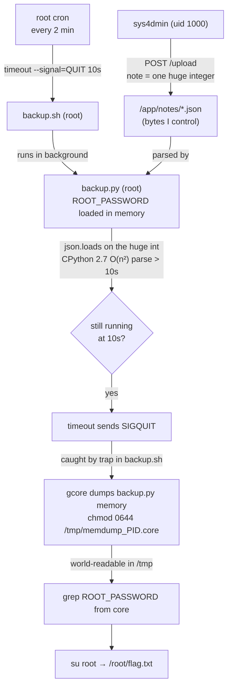
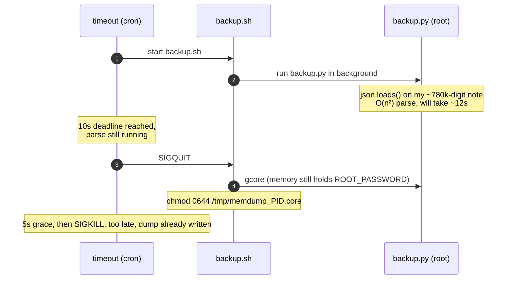

# legacy

## Overview

| | |
|---|---|
| **Event** | DefCamp CTF 2026 |
| **Category** | Misc |
| **Difficulty** | Insane |
| **Author** | Bogdan Carp |

!!! info "Challenge Description"
    Can you privesc? I can't hear youuuuuuu. Aye aye sysadmiiinnnnnnn. A legacy internal note-taking service is running on this box. You've been handed low-privilege SSH access to poke around - what you do with it is up to you. The note-taking web app itself is only reachable from inside the box (127.0.0.1:8080) - it is not exposed on the internet. Everything you need to reach it is available once you're on the host. Please keep your notes.

I get low-priv SSH to a box (`sys4dmin:adminpass`) and a note-taking web app bound to `127.0.0.1:8080` inside it. Goal is root. There's also a second HTTP service on a separate external port, and the description goes out of its way to say the real app is "only reachable from inside the box" and "not exposed on the internet".

## Recon

### The external port

Before touching SSH I curled the external HTTP port. The first request gave me a full working "Jotter" note app. Every request after that came back with a 403 "Sealed - Session Already Active" page, even a brand new curl with no cookie at all.

Reading the app source later explained why. It keeps a single shared session token in server memory (`_active_token`), not one per cookie, so the very first hit from anywhere locks the whole thing. Once it's locked there's nothing I can drive from the outside.

So I left it alone. It wasn't reachable in any useful state, and the description keeps pointing me back at the internal app, so this wasn't going to be my way in. I'm not sure if there was a deliberate decoy or unintended exposure but either way it had nothing to do with how I got root below.

### SSH enumeration

In as `sys4dmin`, just calm enumeration, nothing aggressive. Three things narrowed it down fast:

- There's **no `sudo` binary at all**. So whatever this box is, it isn't a sudo-misconfig.
- Kernel is `6.12.94+` but the userland is Debian 10 "buster", which has been EOL since 2019, and the hostname (`c-d566-...-legacy-...`) is a Kubernetes pod name. That's a shared host kernel far newer than anything a buster-era CVE would go after, so kernel privesc is a dead end too. Whatever the intended path is, it's a userspace or logic bug.
- `ps auxww` shows the internal note app running as **root**, as PID 1:

    ```text
    /usr/local/bin/python /var/run/s3cr3t_py_d1r/webapp.py
    ```

    and `/var/run/s3cr3t_py_d1r/` is world-readable and root-owned. Sitting next to `webapp.py` are `backup.py` and `backup.sh`.

So I'm uid 1000, the thing I want to influence runs as root, and I can read all of its source. That's where I started reading.

## Working out the solve

### Stage 1: what can I actually do to the app?

Reading `webapp.py`, notes get stored at `/app/notes/<8-hex-id>.json`, capped at 10 notes and 5MB each, with the id checked against `^[0-9a-f]{8}$` so there's no path traversal to play with. Two endpoints write files:

- `/save` (POST) writes the note and then calls `_write_config()`, which is never defined anywhere in the file. So every `/save` writes the note fine and then 500s with a `NameError` on its way out. It's the loudest thing on the box and it really looks like a planted hint, but it doesn't actually do anything useful for me.
- `/upload` (POST) writes a note straight from the raw request body, no `_write_config()` call and no JSON validation at all.

So `/upload` gives me a clean way to drop an arbitrary file into `/app/notes/`. That's the only real primitive I've got, and on its own it isn't root. The next question is who reads those files, and as who.

### Stage 2: who consumes the notes, and as root?

That's the backup scripts. There are three custom pieces in `/var/run/s3cr3t_py_d1r/`, all readable by me, so it's worth being clear on what each one does:

- **`webapp.py`** is the note service from Stage 1, running as root on `:8080`. It's what gives me the `/upload` write primitive.
- **`backup.py`** is a root Python 2 script that walks `/app/notes/` and `json.loads()`es every note. This is the bit that matters, because it parses the exact bytes I control through `/upload`. Right at the start of `main()` it also reads `/root/.env` and pulls `ROOT_PASSWORD` into a local variable that it then never touches again. As code that's pointless, but it does keep the root password sitting in the process's memory for the whole run.
- **`backup.sh`** is a wrapper that runs `backup.py` and installs a `SIGQUIT` handler. From my notes it was roughly:

    ```bash
    backup.py &                 # run the real backup in the background
    BPID=$!
    trap 'gcore -o /tmp/dump $BPID; \
          mv /tmp/dump.$BPID /tmp/memdump_$BPID.core; \
          chmod 0644 /tmp/memdump_$BPID.core' QUIT   # on SIGQUIT: dump its memory, world-readable
    wait $BPID
    ```

    A `SIGQUIT` to this wrapper doesn't kill the job cleanly. It snapshots `backup.py`'s live memory into a world-readable file in `/tmp`, which is `drwxrwxrwt`, so I can read it as `sys4dmin`.

And the thing that sends that `SIGQUIT` is cron. `/etc/cron.d` is readable, and root runs this every 2 minutes:

```text
cd /tmp && timeout --signal=QUIT --kill-after=5s 10s /var/run/s3cr3t_py_d1r/backup.sh
```

`timeout` sends `SIGQUIT` if `backup.sh` runs longer than 10 seconds, then hard-kills it 5 seconds later. Normally the backup finishes well under 10s and none of this fires. The whole exploit is about making it not finish in time.

### Stage 3: the chain

Line those facts up and the path falls out:

1. `/upload` a note whose JSON is slow enough to parse that `backup.py` spends more than 10s inside `json.loads()`.
2. `timeout` fires `SIGQUIT` while `backup.py` is still parsing, with `ROOT_PASSWORD` sitting in its memory.
3. `backup.sh`'s trap catches the `SIGQUIT` and `gcore`s `backup.py` before the kill, leaving a world-readable core in `/tmp`.
4. I read the password straight out of that core.



The only piece I'm missing is step 1, making `json.loads()` on a small file burn ten seconds. The `webapp.py` stack is Python 2, and CPython 2.7's conversion of a bare decimal integer literal is O(n²) in the number of digits.[^cpython] A single huge integer as a note value does it, and it's still tiny next to the 5MB/note cap. The flag itself (further down) confirms afterwards that this quadratic parse was the intended trigger.

### Stage 4: confirming the timing

I didn't want to guess the digit count blind and either miss the 10s window or trip the 5s hard-kill, so I measured it locally in my own SSH shell first. Bounded tests, nothing hitting any external infra:

```console
$ python2 -c "import time,json; s='1'*200000;  t=time.time(); json.loads(s); print(time.time()-t)"
0.87
$ python2 -c "import time,json; s='1'*500000;  t=time.time(); json.loads(s); print(time.time()-t)"
5.37
$ python2 -c "import time,json; s='1'*1000000; t=time.time(); json.loads(s); print(time.time()-t)"
21.5
```

~750-800k digits lands comfortably in the 10-15s range, so there's enough margin over the 10s `SIGQUIT` trigger, and it doesn't matter how far past that it would have gone once the trap's `gcore` fires inside the 5s grace.

The timing is the whole trick, so it's worth seeing it against the clock:



## Getting root

Built the payload as a single oversized integer value (still valid JSON) and uploaded it through `/upload` from the SSH shell, against `127.0.0.1:8080` only:

```console
$ python2 -c "print('{\"a\":' + '1'*780000 + '}')" > payload.json
$ curl -X POST --data-binary @payload.json http://127.0.0.1:8080/upload
```

The first upload landed just after a cron tick, so I waited for the next one. On the `13:42:01` tick, `backup.log` showed the whole thing firing:

```text
13:42:01 - INFO - Starting backup of 3 note(s)
13:42:11 - WARN - [*] SIGQUIT caught by wrapper. Attaching GDB/ptrace to PID 244
13:42:11 - WARN - [+] Memory dumped successfully via ptrace.
```

Exactly the timing I expected: `SIGQUIT` at the 10s mark while `backup.py` was still stuck parsing, and the trap dumped it before the kill.

`/tmp/memdump_244.core` showed up, `root:root` owned but `0644`, 4.7MB. There was no `strings` binary on the box, so I just grepped the core file directly:

```console
$ grep -a -o -E 'ROOT_PASSWORD[^"]{0,80}' /tmp/memdump_244.core
ROOT_PASSWORD=3219b1e0...
```

`su root` with that password gave me `uid=0`, and `/root/flag.txt` had the flag.

## Flag

!!! success "Flag"
    ```text
    CTF{L3g4cy_Syst3ms_H4v3_Fun_Att4cks_D0s_on_python2}
    ```

The flag names the mechanic right on the nose. The CPython 2.7 quadratic-time integer parse was the actual trigger, not a side detail.

## Notes

- From first SSH login to flag was under 15 minutes, all of it reading source and config files, one local timing test, and one payload. I never ran linpeas or pspy or anything like that, didn't need to.
- The `_write_config()` `NameError` in `/save` was the loudest thing on the box and it went nowhere. The real bug was quiet: a variable that gets loaded and never used.
- Every piece of this is legitimate, boring sysadmin tooling. Cron, `timeout`, a `SIGQUIT` trap, `gcore`. None of it is a "vulnerability" on its own, it only becomes one because of how the pieces are wired together, so a DoS on the backup turns into a root-memory disclosure.

## References

[^cpython]: CPython's `int(str)`/`long(str)` decimal conversion was quadratic in the number of digits for a long time; later versions cap it behind `sys.set_int_max_str_digits` (see CVE-2020-10735): <https://github.com/python/cpython/issues/95778>
