---
tags:
  - misc
  - osint
  - geoint
  - socmint
  - gpn-ctf-2026
---

# Culinary Circles

## Overview

|  |  |
|---|---|
| **Event** | GPN CTF 2026 |
| **Category** | Miscellaneous |
| **Difficulty** | Medium |
| **Author** | Alkalem |

!!! info "Challenge Description"
    Why do some people care so much about social circles? Let us focus on cuisine and peoples tastes instead. Talk with others about food and in rare cases your culinary circles might intersect.
    
    **Note:** Use OpenStreetMap as source of truth for the locations and their names. The solution is the location of a restaurant, formatted as flag, e.g., `GPNCTF{The French Laundry}`. Precision may be required.

The handout ("Takeout Order") was nine images, each titled a different name (presumably members of the culinary circle). Each image showed a different restaurant. I solved this challenge by finding all nine, verifying against OpenStreetMap, then used them to find a tenth restaurant where the "culinary circles intersect".

First thing I checked was metadata, but exiftool came up empty on all nine. That's expected for this kind of challenge. After that it was basic OSINT, as shown below.

## The nine locations

Click a name to jump to it, or use the arrows to step through.

<style>
.cc-carousel{border:1px solid var(--cv-border);border-radius:.5rem;overflow:hidden;background:var(--cv-surface);margin:1.2rem 0;}
.cc-nav{display:flex;flex-wrap:wrap;gap:.25rem;padding:.55rem .6rem;background:var(--cv-surface);border-bottom:1px solid var(--cv-border);}
.cc-pill{font-family:"IBM Plex Mono",monospace;font-size:.66rem;letter-spacing:-.01em;color:var(--cv-fg-dim);background:transparent;border:1px solid var(--cv-border);border-radius:5px;padding:.18rem .42rem;cursor:pointer;transition:border-color .12s ease,color .12s ease,background .12s ease;}
.cc-pill:hover{border-color:var(--cv-cyan);color:var(--cv-cyan);}
.cc-pill.on{background:var(--cv-cyan);color:#16161e;border-color:var(--cv-cyan);}
.cc-slide{padding:1rem 1.1rem;}
.cc-slides>.cc-slide:not(:first-child){display:none;}
.cc-img{display:block;margin:0 auto .7rem;max-height:460px;max-width:100%;width:auto;border-radius:6px;border:1px solid var(--cv-border);}
.cc-bar{display:flex;align-items:center;justify-content:space-between;gap:.6rem;padding:.5rem .7rem;border-top:1px solid var(--cv-border);background:var(--cv-surface);}
.cc-arrow{display:inline-flex;align-items:center;background:var(--cv-surface-2);border:1px solid var(--cv-border);border-radius:6px;color:var(--cv-fg-dim);cursor:pointer;padding:.3rem .55rem;line-height:1;}
.cc-arrow:hover{border-color:var(--cv-cyan);color:var(--cv-cyan);}
.cc-count{font-family:"IBM Plex Mono",monospace;font-size:.72rem;color:var(--cv-muted);}
</style>

<div class="cc-carousel" markdown>
<div class="cc-slides" markdown>

<section class="cc-slide" data-name="adam" markdown>
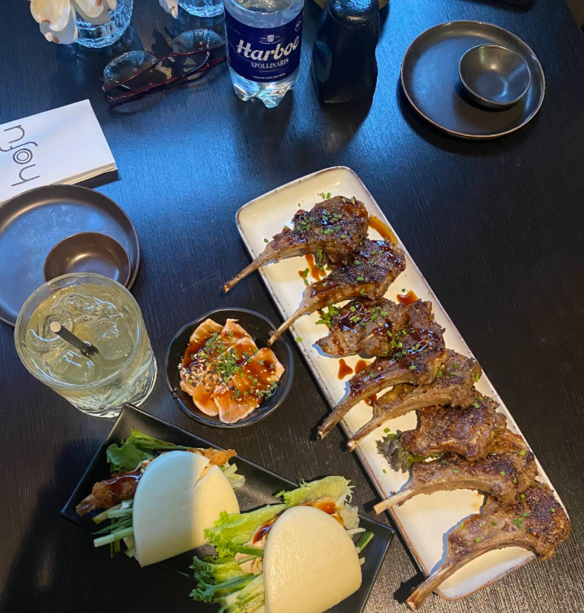{ .cc-img }
The napkin has "hofu" and the logo on it, and the water bottle is Harboe Apollinaris, a Danish brewery. Searching `Hofu restaurant Denmark` brings up Hofu's socials/website which provides the address. The logo and menu items match our image.

**Hofu**, Vestergade 19C, 4600 Køge, Denmark.
</section>

<section class="cc-slide" data-name="alice" markdown>
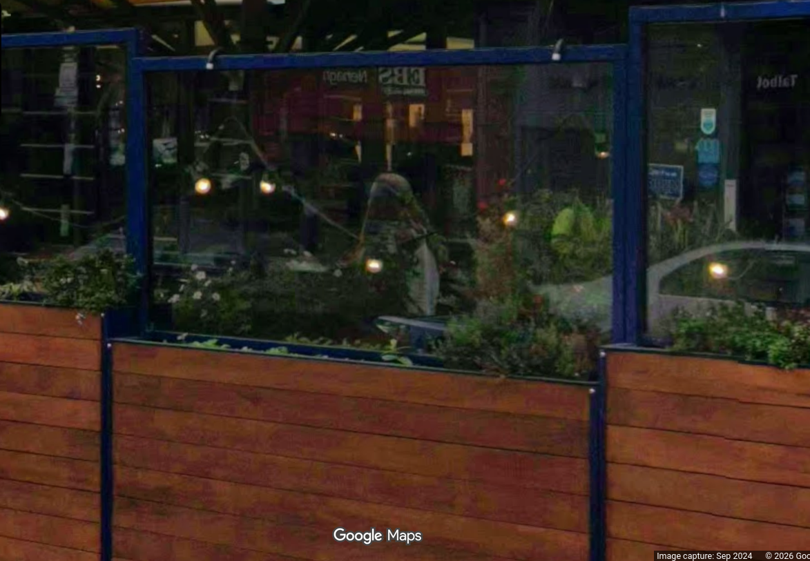{ .cc-img }
Everything useful here is in the reflection. Flip the photo horizontally and you can read "Talbot" and "EBS Nenagh" on the red building behind.

The EBS website has a new location for EBS Nenagh, but searching quickly leads to posts confirming the old Nenagh branch's address. The place across the road lines up with the photo on Street View.
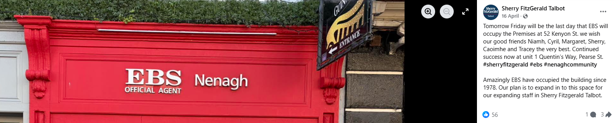{ .cc-img }

**The Peppermill**, 26 Kenyon St, Nenagh, Tipperary, Ireland.
</section>

<section class="cc-slide" data-name="alkalem" markdown>
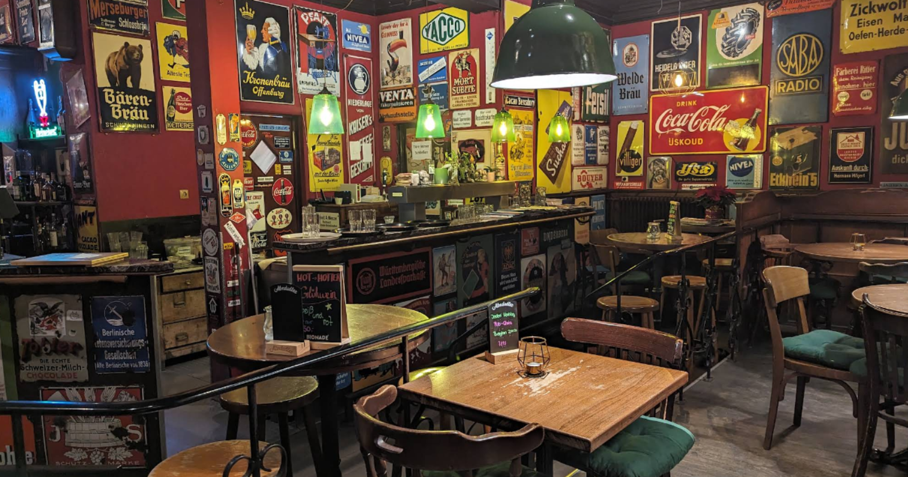{ .cc-img }
German decor and branding. A reverse image search flags it straight away as Kippe 23, Karlsruhe. The other interior photos online have the same wall posters, chairs and light fittings.

**Kippe 23**, Gottesauer Str. 23, 76131 Karlsruhe, Germany.
</section>

<section class="cc-slide" data-name="beatrice" markdown>
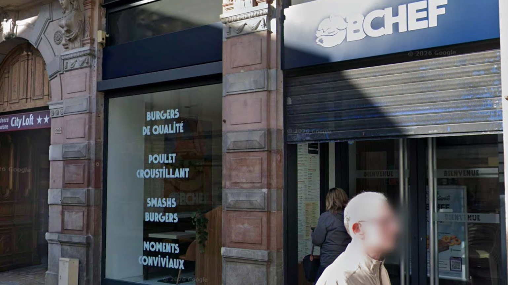{ .cc-img }
French text on the glass, "bienvenue" on the doors. Reverse image searching the BCHEF logo leads to a match on the French burger chain, but there are loads of stores. The photo has it sitting next to a City Loft though, and there's only one City Loft next to a BCHEF on OSM. Street View confirms it.

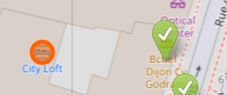{ .cc-img }

**BCHEF**, 94 Rue des Godrans, 21000 Dijon, France.
</section>

<section class="cc-slide" data-name="bob" markdown>
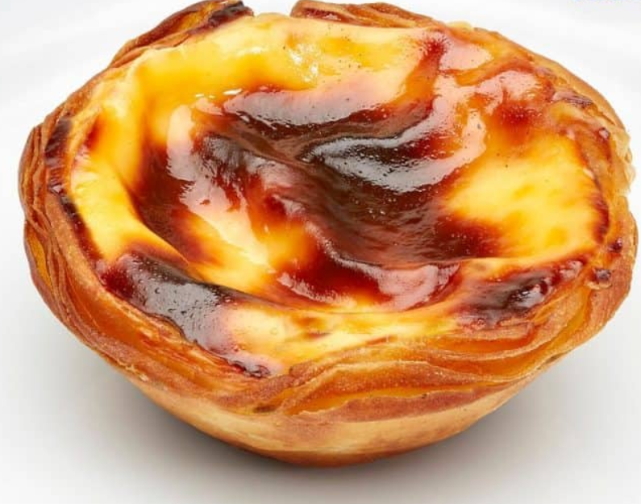{ .cc-img }
Just a pastel de nata, nothing else in the shot. (I used to bake these.) I started by looking up where the nata comes from, which pointed at Pastéis de Belém. That turned out to be right, but I don't think it was the intended route.

After the solve I redid it properly with Yandex reverse image search, which is usually better than Google for this stuff, and it gives an exact match with the address on it.

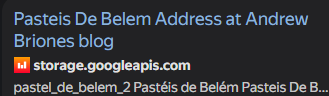{ .cc-img }

**Fábrica de Pastéis de Belém**, Rua de Belém 84–92, Lisbon 1300, Portugal.
</section>

<section class="cc-slide" data-name="bruno" markdown>
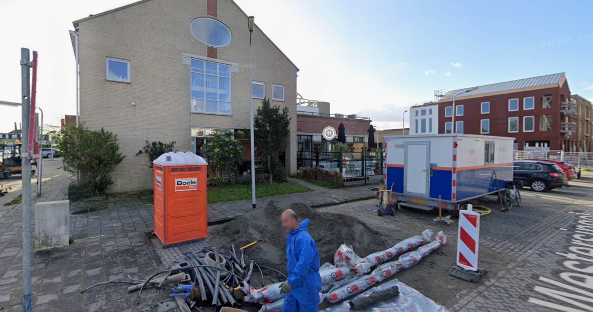{ .cc-img }
This one's a 2026 Street View grab, with the cuisine icon sitting right over the name. It's the Netherlands: the architecture, a Boels portable toilet (the company has a Netherlands HQ), and you can just make out "Westersingel" in the bottom-right corner.

Westersingel ("west canal") is a common street name, so it took some Street View exploration, but it eventually matched in South Holland.

**Restaurant en Eventlocatie Marie** (formerly Mak Kitchen), Westersingel 80, 2651 EL Berkel en Rodenrijs, Netherlands.
</section>

<section class="cc-slide" data-name="carol" markdown>
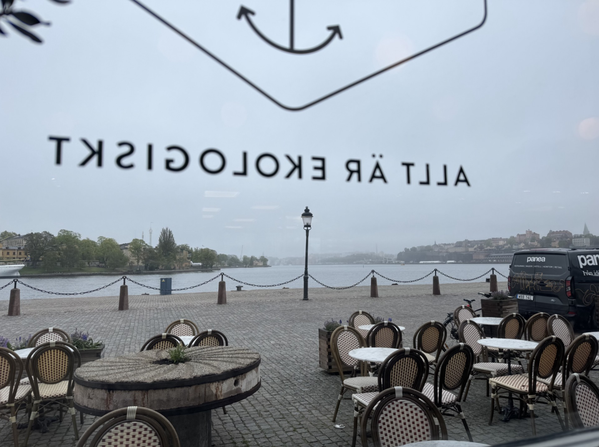{ .cc-img }
Waterside, with Swedish on the window: `allt är ekologiskt` (everything's organic). Reverse search shows the same waterfront railings in Stockholm's Old Town and points at Skeppsbro Bageri. Street View has the same windows, the same chairs out front, and the same view across the water.

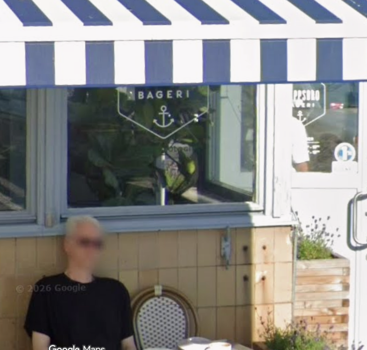{ .cc-img }

Didn't need it, but the "Panea Stockholm" van in shot is a bakery delivery company.

**Skeppsbro Bageri**, Skeppsbron, Stockholm, Sweden.
</section>

<section class="cc-slide" data-name="catherine" markdown>
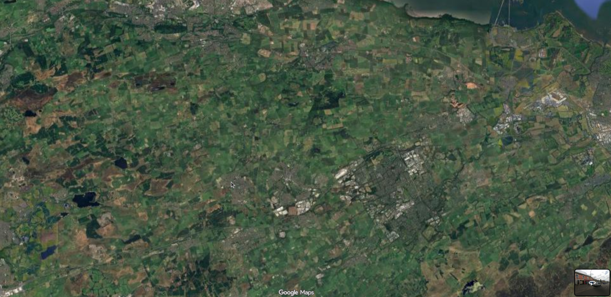{ .cc-img }
A satellite/Maps screenshot. Reverse search drops it in West Lothian, Scotland, and the landmarks (Whitehill Industrial Estate and so on) line up.

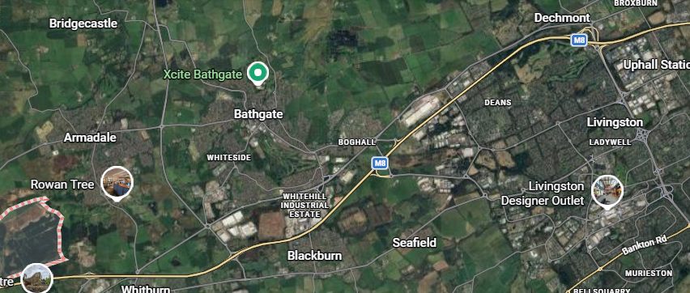{ .cc-img }

Catherine's mouse cursor is parked over a part of Armadale, and the small Street View thumbnail in the corner gives me something to match: red-brick top floor, red-and-blue shopfront below. Only one restaurant near the pointer fits.

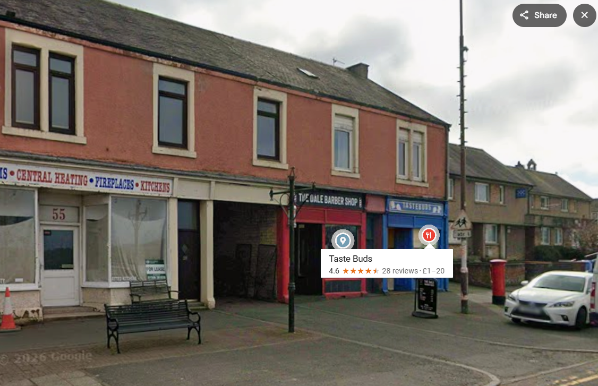{ .cc-img }

**Taste Buds**, 65 W Main St, Armadale, Bathgate EH48 3PZ, UK.
</section>

<section class="cc-slide" data-name="cristoph" markdown>
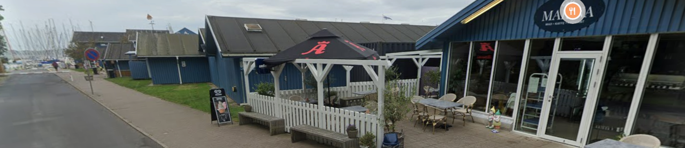{ .cc-img }
The Street View icon covers most of the logo, but with the boats behind and a visible "Marina" the name's a fair guess. The sign reads "Mad · Kaffe · …" (Danish for food and coffee), so Denmark.

There's a Finnish flag in shot that might be a deliberate red herring, but the Danish text, the garden gnomes by the door, the Frisko ice-cream logo and the Albani umbrella all say Denmark. I found a Facebook post with the same gnomes outside the café, and Street View backs it up.

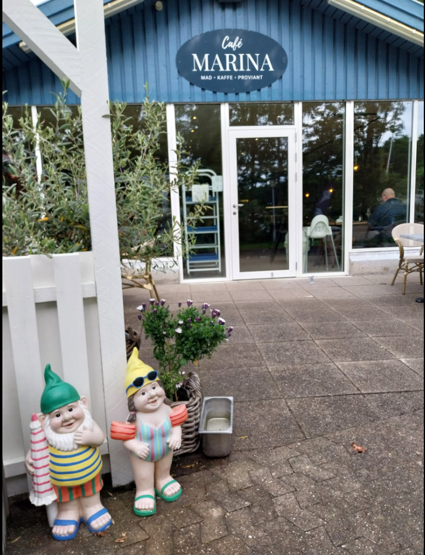{ .cc-img }

**Café Marina**, Marina Allé 8, 6400 Sønderborg, Denmark.
</section>

</div>
</div>

<script>
(function () {
  function init(root) {
    var slides = Array.prototype.slice.call(root.querySelectorAll(".cc-slide"));
    if (!slides.length) return;
    var nav = document.createElement("div");
    nav.className = "cc-nav";
    var pills = slides.map(function (s, i) {
      var b = document.createElement("button");
      b.type = "button";
      b.className = "cc-pill";
      b.textContent = s.getAttribute("data-name") || String(i + 1);
      b.addEventListener("click", function () { show(i); });
      nav.appendChild(b);
      return b;
    });
    var bar = document.createElement("div");
    bar.className = "cc-bar";
    var prev = document.createElement("button");
    prev.type = "button"; prev.className = "cc-arrow"; prev.setAttribute("aria-label", "Previous");
    prev.innerHTML = '<svg width="16" height="16" viewBox="0 0 24 24" fill="none" stroke="currentColor" stroke-width="2" stroke-linecap="round" stroke-linejoin="round"><path d="M15 18l-6-6 6-6"/></svg>';
    var next = document.createElement("button");
    next.type = "button"; next.className = "cc-arrow"; next.setAttribute("aria-label", "Next");
    next.innerHTML = '<svg width="16" height="16" viewBox="0 0 24 24" fill="none" stroke="currentColor" stroke-width="2" stroke-linecap="round" stroke-linejoin="round"><path d="M9 18l6-6-6-6"/></svg>';
    var count = document.createElement("span");
    count.className = "cc-count";
    prev.addEventListener("click", function () { show(cur - 1); });
    next.addEventListener("click", function () { show(cur + 1); });
    bar.appendChild(prev); bar.appendChild(count); bar.appendChild(next);
    var slidesWrap = root.querySelector(".cc-slides");
    root.insertBefore(nav, slidesWrap);
    root.appendChild(bar);
    var cur = 0;
    function show(i) {
      cur = (i + slides.length) % slides.length;
      slides.forEach(function (s, j) { s.style.display = j === cur ? "block" : "none"; });
      pills.forEach(function (p, j) { p.classList.toggle("on", j === cur); });
      count.textContent = (cur + 1) + " / " + slides.length;
    }
    root.tabIndex = 0;
    root.addEventListener("keydown", function (e) {
      if (e.key === "ArrowLeft") { show(cur - 1); e.preventDefault(); }
      else if (e.key === "ArrowRight") { show(cur + 1); e.preventDefault(); }
    });
    show(0);
  }
  function boot() { document.querySelectorAll(".cc-carousel").forEach(init); }
  if (document.readyState !== "loading") boot();
  else document.addEventListener("DOMContentLoaded", boot);
})();
</script>

## The nine points

| Image | Restaurant | Country | Coordinates |
|---|---|---|---|
| adam | Hofu | Denmark | 55.456927, 12.178578 |
| alice | The Peppermill | Ireland | 52.861685, −8.198295 |
| alkalem | Kippe 23 | Germany | 49.007485, 8.419360 |
| beatrice | BCHEF | France | 47.322683, 5.038170 |
| bob | Fábrica de Pastéis de Belém | Portugal | 38.697158, −9.202171 |
| bruno | Restaurant Marie (Westersingel) | Netherlands | 51.995570, 4.475775 |
| carol | Skeppsbro Bageri | Sweden | 59.324842, 18.076136 |
| catherine | Taste Buds | Scotland | 55.898263, −3.702635 |
| cristoph | Café Marina | Denmark | 54.899430, 9.795497 |

## Culinary circles

We have our nine locations but there's a tenth restaurant to find, where the culinary circles "intersect". My first thought was to average the nine locations, but that doesn't really fit the word intersect and it ignores the names. The names are the hint: the members start with A, B and C, so it's three groups of three.

- **A:** Adam, Alice, Alkalem
- **B:** Beatrice, Bob, Bruno
- **C:** Carol, Catherine, Cristoph

Any three points (that aren't colinear) can define a circle, so each letter group (A,B,C) gives us a circle. If there is a point where all 3 circles intersect, we can literally find the restaurant where "culinary circles intersect."

The only issue is that these are points on a sphere, not a flat map, so they're small circles and the intersection has to be done spherically. (Cachesleuth's [3-circle tool](https://www.cachesleuth.com/intersection3circles.html) does it too if you don't want to write code.)

### The maths

Put each location on the unit sphere as a vector (x, y, z) from the centre of the Earth. Any three points define a plane, and the cross product of two of its edges gives that plane's normal. Normalise it and you have the circle's axis; its dot product with any of the three points is cos of the angular radius. So a small circle is just the points on the sphere that satisfy one linear equation, **n · x = c**.

Three planes like that meet at a single point. Drop the three equations into a 3×3 system **N x = c**, solve it, normalise the answer back onto the sphere, and convert to lat/long.

```python
import numpy as np

# 3 sets of coords
groups = {
    "A": [(55.456927, 12.178578), (52.861685, -8.198295), (49.007485, 8.419360)],
    "B": [(47.322683, 5.038170), (38.697158, -9.202171), (51.995570, 4.475775)],
    "C": [(59.324842, 18.076136), (55.898263, -3.702635), (54.899430, 9.795497)],
}

# Convert lat/lon to 3D unit vector
def to_vec(lat, lon):
    lat, lon = np.radians([lat, lon])
    return np.array([np.cos(lat) * np.cos(lon),
                     np.cos(lat) * np.sin(lon),
                     np.sin(lat)])

N, C = [], []
for pts in groups.values(): # Def plane equation
    v = [to_vec(*p) for p in pts]
    n = np.cross(v[1] - v[0], v[2] - v[0]) # Normal vector is cross product of 2 edges 
    n /= np.linalg.norm(n)
    if np.dot(n, v[0]) < 0:          # point the normal towards the points
        n = -n
    N.append(n)
    C.append(np.dot(n, v[0]))        # c = cos(angular radius)

x = np.linalg.solve(np.array(N), np.array(C))   # common point of the 3 planes
x /= np.linalg.norm(x)                           # normalise to project back onto the sphere

# convert back to lat and lon
lat = np.degrees(np.arcsin(x[2])) 
lon = np.degrees(np.arctan2(x[1], x[0]))
print(f"{lat:.4f}, {lon:.4f}")
```

Running it:

```console
$ python3 solve.py
57.4352, -6.5961
```

The prompt and the printed output are dimmed and excluded from a copy — hitting the copy button on that block yields just `python3 solve.py`.

### The map

The three circles and where they meet, on a real map. Toggle each one on the left:

<iframe src="three_circle_ctf.html" title="Three-circle intersection on the Isle of Skye" style="width:100%;height:520px;border:1px solid var(--cv-border);border-radius:8px;"></iframe>

### Findings

That point, 57.4352°N, 6.5961°W, sits on the Isle of Skye. The nearest restaurant on OSM and Google Maps is The Three Chimneys (and its rooms, The House Over-by). Website pictured below:

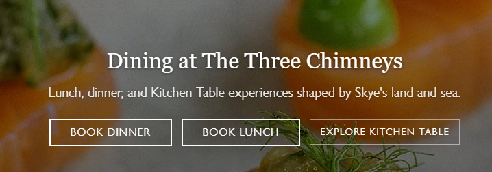{ .cc-img }


!!! success "Flag"
    ```text
    GPNCTF{The Three Chimneys}
    ```

## Notes / lessons

Although, I wasn't playing for the leaderboard, I did challenge this activity in-part because it had no solves and was worth high points. However, I learned that GPN's scoring decays as more teams solve, even retroactively, so going after the highest-value challenges first wasn't the edge I assumed it would be. I had second blood on Culinary Circles at the full 500, and by the end of the event it was down to 119.

## References

- Challenge handout (GPN CTF 2026, *Culinary Circles* by Alkalem): <https://gpn24.ctf.kitctf.de/api/challenges/handout/culinary-circles>