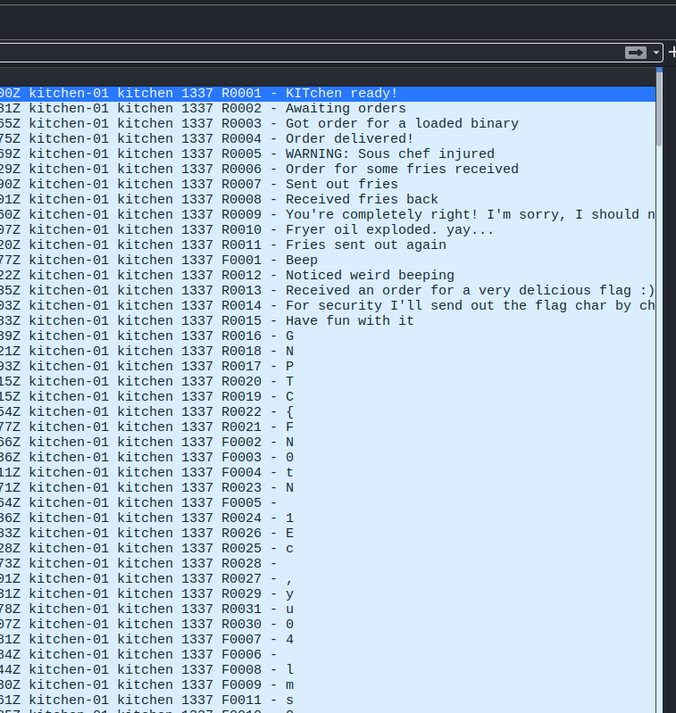
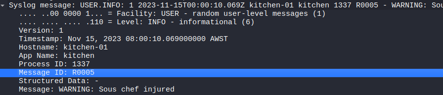
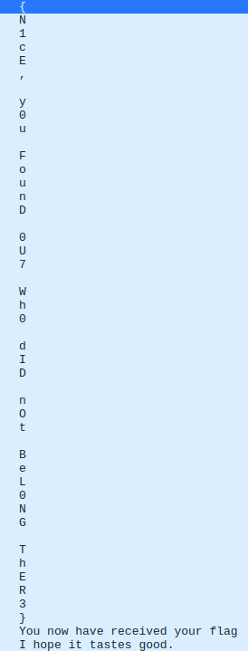

---
tags:
  - misc
  - network trace analysis
  - wireshark
  - gpn-ctf-2026    
---

# Double Fried

## Overview

|  |  |
|---|---|
| **Event** | GPN CTF 2026 |
| **Category** | Miscellaneous, Introduction |
| **Difficulty** | Low |
| **Author** | Misterpine |

!!! info "Challenge Description"
    I was planning to go to dinner with a friend but somthing felt off.
    Can you help me sort everything out?

The handout ("Takeout Order") was a network trace called `kitchen_log.pcap`. Analysing this in Wireshark providing us some communications with the kitchen, with our flag contained within.

## Challenge

Open the packet capture in Wireshark. 
```bash
wireshark kitchen_log.pcap
```

The PCAP contains messages from the kitchen including the following:
"Received an order for a very delicious flag"
"For security I'll send out the flag char by char"

{ .cc-img }

We receive the flag in a jumbled order. 

The packets ordered by time is jumbled a little out of order.

In the syslog/info column there is a section that has the order of receival (R0016, R0018, R0017 and so on).

We can add this "Message ID" as its own column

{ .cc-img }


Now with that column, we can sort its values to get the correct order of the flag.

{ .cc-img }

We can reassemble the flag character by character.

## Flag

!!! success "Flag"
    ```text
    GPNCTF{N1cE, y0u FounD 0U7 Wh0 dID nOt BeL0NG ThER3}
    ```
