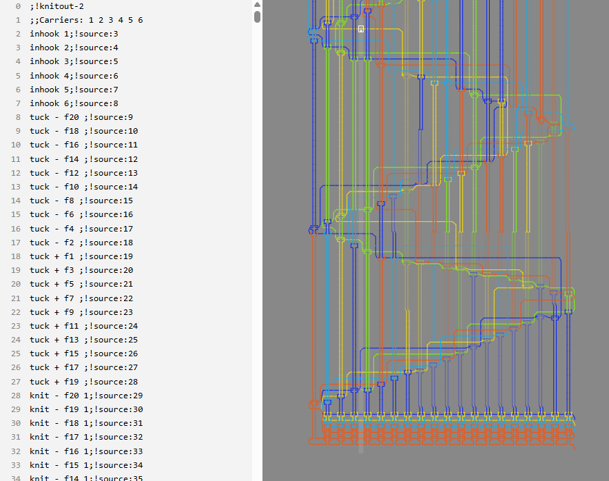

# Knitted Flag

## Overview

|  |  |
|---|---|
| **Event** | GPN CTF 2026 |
| **Category** | Miscellaneous |
| **Difficulty** | Low |
| **Author** | PlantPalFynn |

!!! info "Challenge Description"
    I got a new knitting machine to help me with the tablecloths for the restaurant but I accidentally dropped my flag into it. Can you help me unravel it?

One file, `pattern.k`, which the description says we need to "unravel" to find the flag.

Here's the top of `pattern.k`:

```
;!knitout-2
;;Carriers: 1 2 3 4 5 6
inhook 1
...
knit - f20 1
knit - f19 1
knit - f18 2
knit - b17 3
knit - f16 1
...
```

That `;!knitout-2` line and a quick search tells me this is **Knitout**: a low-level, machine-independent format for driving flat-bed knitting machines[^knitout]. Worth reading the spec, because the file's structure *is* the puzzle here.

The only opcode I actually care about is `knit`, which the spec says takes three parameters:

```
knit  <direction>  <needle>  <carrier set>
```

- **Direction** (`+`/`-`): which way the carriage is moving. `+` counts needles up, `-` counts down.
- **Needle** (`f20`, `b17`, …): a bed letter plus a number. On a V-bed machine `f` is the front bed, `b` is the back, and the numbers run 1 to 20.
- **Carrier set**: which yarn carrier is in play. The header declares six of them, so on a real machine this is basically your colour picker.

So each stitch hands me several independent values. The obvious guess is that the six carriers are six colours, and knitting it will paint a pixel grid that spells out the flag. 

## Loading it in the visualiser

There's a [browser visualiser](https://textiles-lab.github.io/knitout-live-visualizer/) for exactly this format, so I dropped `pattern.k` straight in.

{ .cc-img }

Yeah, nah. It renders a topological picture of the yarn paths, which is the correct output if you're actually knitting, but is not a legible flag. Looking at the carriers directly in the flag confirms that the "obvious" colour channel is a decoy. THere are no runs, no blocks, nothing text would ever produce. Just noise. 

## The real signal: the bed

Here's the bit I missed on the first read. Every stitch carries *two* almost-binary channels, not one. The carrier is the loud one. The quiet one is the **bed**: each stitch is either `f` or `b`. One clean bit per stitch, and unlike the carriers it's not random.

And the data is already shaped like an image. Each carriage pass is a fixed 20 stitches, so a pass is a row 20 pixels wide, and the file has 978 of them. Take each bed as a pixel, `f` white and `b` black, lay the passes out as rows, and the picture should fall out.

## Building the solve script

The bit mapping is the easy part. The annoying part is rebuilding the grid.

**1. Keep only the `knit` lines.** Everything else (`inhook`, headers, and friends) is scaffolding. I grab the direction, bed letter, needle number, and carrier off each `knit`. The carrier I keep purely so my parser isn't lying about the line format. It never gets used again.

**2. Where does a row actually end?** The stitches are a flat list, but I need rows, and each carriage pass is one row. A knitting carriage moves in *boustrophedon*: alternating direction for each new row. That gives me two ways to spot a row boundary:

- The direction flips. The easy, normal case.
- The direction *doesn't* flip but the needle number jumps the wrong way. Inside a `-` pass the needles tick down (20, 19, 18, …). If I'm mid-pass and suddenly see a *higher* needle, a new pass has begun without the sign changing. Mirror it for `+` passes.

Watching both means I'm not betting on the file alternating direction cleanly. I start a new row the moment the motion stops being monotonic.

**3. Bed to pixel.** With the stitches grouped into passes, each pass is one column of the image. For each stitch I write `1` for `f` and `0` for `b`, dropped at the needle's position. I index as `NEEDLES - needle` so needle 20 sits at the top and needle 1 at the bottom, which keeps the text upright instead of flipped.

**4. Orientation.** Built like this it comes out tall and skinny: 20 wide, 978 tall, text running straight up. After generating the image, a 90° rotation drops it into normal left-to-right reading. (And *that's* why the pattern is 20 needles wide: the pixel font is 20 px tall, which turns into 20 px of image height once rotated).

All together:

```python
import sys
from PIL import Image

NEEDLES = 20  # stitches per pass (image width before rotating)

def parse(path):
    ops = []
    with open(path) as f:
        for line in f:
            tok = line.split()
            if tok and tok[0] == "knit":  # ignore any non-knit operatros (headers, inhook, etc.)
                ops.append((tok[1], tok[2][0], int(tok[2][1:]), int(tok[3])))
                #            dir   bed           needle           carrier
    return ops

def group_passes(ops): # Split stich back into carriage passes (a pass = a row).
    passes, cur, prev = [], None, None
    for direction, bed, needle, _ in ops:
        # New pass when carriage reverses OR when needle counts wrong way (a same-dir pass boundary).
        if (cur is None or cur[0] != direction
                or (direction == "-" and needle > prev)
                or (direction == "+" and needle < prev)):
            cur = [direction, []]
            passes.append(cur)
        cur[1].append((bed, needle))
        prev = needle
    return passes

ops   = parse(sys.argv[1])
rows  = group_passes(ops)

# One column per pass; needle position is the row. f -> white (1), b -> black (0).
img = Image.new("1", (len(rows), NEEDLES), 1)
px  = img.load()
for col, (_, stitches) in enumerate(rows):
    for bed, needle in stitches:
        px[col, NEEDLES - needle] = 1 if bed == "f" else 0  # flip so text is upright

img.save(sys.argv[2])  # Sideways image saved
print(f"{len(rows)}x{NEEDLES} -> {sys.argv[2]}")
```

```console
$ python3 solve.py pattern.k flag.png
978x20 -> flag.png
```

## Reading the rotated output

{ .cc-img }

There it is, in pixelised font with the leetspeak. The most frustrating part of this whole challenge was differentiating the `0`/`O` and `1`/`l`. But differences are present and you just have to look closely.

Translated from leet, it reads: *congratulations you have understood knitout and unraveled the tablecloths*.

## Flag

!!! success "Flag"
    ```text
    GPNCTF{coN6R47U14TIoNS_YOu_hAVe_unders7o0D_kn1t0ut_anD_Unr4ve13d_tH3_7aBleClO7H5}
    ```

## Notes / lessons

- **Check every channel, not just the loud one.** Knitout gives you direction, bed, needle, and carrier per stitch. The carrier is the one shouting, the bed is the one that mattered. When a format hands you multiple dimensions, any of them could be carrying the payload.
- **The visualiser was still worth it.** It had nothing useful to say once the real data skipped the colour channel, but ruling it out fast is how you find where the signal *isn't*, which is half of finding where it is.

## References

- Knitout live visualiser: <https://textiles-lab.github.io/knitout-live-visualizer/>
- Knitout source: <https://github.com/textiles-lab/knitout>

[^knitout]: Knitout specification (v0.6), Jim McCann / Textiles Lab, Carnegie Mellon University: <https://textiles-lab.github.io/knitout/knitout.html>