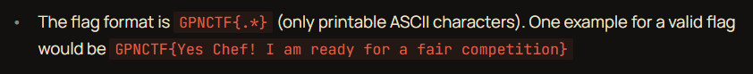

---
tags:
  - misc
  - gpn-ctf-2026
---

# Sanity Check

## Overview

|  |  |
|---|---|
| **Event** | GPN CTF 2026 |
| **Category** | Miscellaneous |
| **Difficulty** | Low |
| **Author** | KITCTF |

!!! info "Challenge Description"
    Are all plates clean? The vegetables chopped? Is your work surface clean? The oven preheated and the fridge cold?

    Your head chef might ask these questions while we just ask if you've reviewed our rule.

## Challenge

This is a classic sanity check freebie. The **example flag** in the GPN CTF event rulebook is our valid flag.

{ .cc-img }

## Flag

!!! success "Flag"
    ```text
    GPNCTF{Yes Chef! I am ready for a fair competition}
    ```
