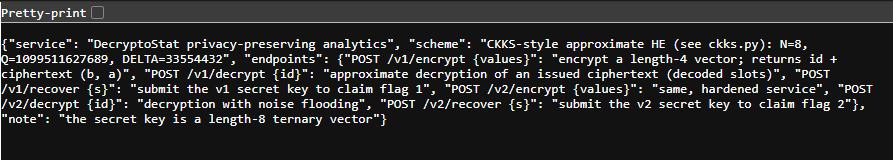

# Loose Lips

## Overview

| | |
|---|---|
| **Event** | H7CTF 2026 Quals |
| **Category** | Crypto |
| **Difficulty** | Hard |

!!! info "Challenge Description"
    DecryptoStat crunches the numbers without ever peeking at your data, or so the pitch deck promises. The original service still hums along beside the hardened rewrite that was meant to make it behave.

    Both of them are hopeless at keeping a secret.

    HTTPS: `https://$HOST`

    File: `ckks.py`

The challenge gives a live Docker instance running the "DecryptoStat" service and a single handout, `ckks.py`, which is the homomorphic encryption scheme the service uses. There are two versions of the service running side by side (the original and the "hardened rewrite") and each one has its own flag, handed out if you submit that version's secret key.

## Recon

### The service

`GET /` on the instance documents its own API as a JSON blob:



Summed up:

- **service:** "DecryptoStat privacy-preserving analytics"
- **scheme:** "CKKS-style approximate HE (see ckks.py)" with `N=8`, `Q=1099511627689`, `DELTA=33554432`
- **note:** the secret key is a length-8 ternary vector

| Endpoint | What it does |
|---|---|
| `POST /v1/encrypt {values}` | encrypt a length-4 vector, returns an id and the ciphertext `(b, a)` |
| `POST /v1/decrypt {id}` | approximate decryption of an issued ciphertext (decoded slots) |
| `POST /v1/recover {s}` | submit the v1 secret key for flag 1 |
| `POST /v2/encrypt {values}` | same, hardened service |
| `POST /v2/decrypt {id}` | decryption with noise flooding |
| `POST /v2/recover {s}` | submit the v2 secret key for flag 2 |

So the whole game is: get the secret key \(s\) out of each version, using nothing but its encrypt and decrypt endpoints. v1 is the plain scheme, v2 is the same thing with an extra defence bolted onto decryption.

### The handout

`ckks.py` is a tiny CKKS implementation, and the comment at the top basically tells you where to look:

```python
# minimal CKKS-style approximate homomorphic encryption used by the analytics
# service. shipped so the scheme is known: ring R_q = Z_q[x]/(x^N+1), encoding by
# the canonical embedding at the primitive 2N-th roots of unity. the flaw is not in
# this code; it is that the service returns the approximate (noisy) decryption.
```

```python
N = 8
Q = (1 << 40) - 87           # prime modulus
DELTA = 1 << 25              # scale
```

`Q = 2^40 - 87` is the `1099511627689` from the landing page and `DELTA = 2^25` is the `33554432`.

"The service returns the approximate (noisy) decryption" is the exact precondition for the **Li-Micciancio attack** from "On the Security of Homomorphic Encryption on Approximate Numbers" (Eurocrypt 2021).[^lm] The handout comment is pretty much the abstract of that paper. It showed that in CKKS, a decryption result plus the ciphertext it came from is enough to recover the secret key, and they did it against real libraries (HEAAN, SEAL, HElib, PALISADE). It's also why they proposed a stronger security notion, IND-CPA\(^D\), where the attacker is allowed to see decryption results. v2's "noise flooding" is the standard countermeasure that came out of that line of work, so the second half of the challenge is really about whether it was deployed properly.

## Background: how CKKS works

CKKS is a homomorphic encryption scheme for *approximate* arithmetic. You can add and multiply real or complex numbers while they're encrypted, and the answer comes out close to right instead of exactly right. That "close to" is the part that matters here, so it's worth going through what happens to a vector of numbers on the way in and out.

### The ring

Everything lives in the polynomial ring \(R_Q = \mathbb{Z}_Q[x]/(x^N + 1)\): polynomials with \(N = 8\) coefficients, each coefficient mod \(Q\), and whenever a product produces an \(x^N\) you replace it with \(-1\). That wraparound with a sign flip is called *negacyclic*, and you can see it in `ring_mul`, where the top half of the product gets subtracted from the bottom half:

```python title="ckks.py (excerpt)"
def ring_mul(a, b):
    res = [0] * (2 * N)
    for i in range(N):
        if a[i]:
            for j in range(N):
                res[i + j] = (res[i + j] + a[i] * b[j]) % Q
    return [(res[i] - res[i + N]) % Q for i in range(N)]
```

### Encoding: numbers to a polynomial

The user's data is a vector of \(N/2 = 4\) complex numbers (the "slots"). To turn that into an integer polynomial, CKKS uses the *canonical embedding*: evaluate a polynomial at the primitive \(2N\)-th roots of unity \(\omega^{1}, \omega^{3}, \dots, \omega^{15}\) with \(\omega = e^{i\pi/N}\). That evaluation is a matrix \(V\) (a Vandermonde matrix), so going the other way is just \(V^{-1}\).

```python title="ckks.py (excerpt)"
_pows = [2 * k + 1 for k in range(N)]
_roots = np.array([np.exp(1j * np.pi * p / N) for p in _pows])
_V = np.array([[r ** k for k in range(N)] for r in _roots])
_Vinv = np.linalg.inv(_V)

def decode(poly):
    """int poly -> complex slot vector (length N/2), scaled down by DELTA."""
    return list((_V @ _center(poly))[:N // 2] / DELTA)

def encode(z):
    """complex slot vector (length N/2) -> integer plaintext poly (length N)."""
    z = np.array(z, dtype=complex)
    full = np.concatenate([z, np.conj(z[::-1])]) * DELTA
    return [int(round(c.real)) % Q for c in (_Vinv @ full)]
```

A few details worth pointing out:

- There are 8 roots but only 4 slots. A polynomial with real coefficients evaluated at a root and at its complex conjugate gives conjugate values, and the conjugate of \(\omega^{2k+1}\) is the root at the mirrored index. So only half the evaluations are free, which is why `encode` builds the other half with `np.conj(z[::-1])` and `decode` only returns the first `N // 2`.
- The slots get multiplied by the scale \(\Delta = 2^{25}\) before \(V^{-1}\), then rounded to integers. Scaling is how CKKS keeps precision: rounding to an integer only loses about \(1/\Delta \approx 3 \times 10^{-8}\) in the slot values.
- `decode` works on the *centered* coefficients (`_center` maps each one into \((-Q/2, Q/2]\)), then divides by \(\Delta\) and hands back floats. There's no rounding on the way out.

### Encryption and decryption

The secret key is a small polynomial, here ternary (every coefficient in \(\{-1, 0, 1\}\)). Encryption is RLWE: pick a uniformly random \(a\), a small error \(e\), and hide \(m\) behind \(a \cdot s\):

```python title="ckks.py (excerpt)"
def keygen():
    return small(1)                                  # ternary secret key

def encrypt(values, s):
    m = encode(values)
    a = rand_poly()
    e = small(3)
    b = ring_add(ring_sub([0] * N, ring_mul(a, s)), ring_add(m, e))   # b = -a*s + m + e
    return b, a

def decrypt(ct, s, smudge=0):
    """return the APPROXIMATE decryption (decoded slots). b + a*s = m + e."""
    b, a = ct
    d = ring_add(b, ring_mul(a, s))
    if smudge:
        d = ring_add(d, small(smudge))
    return decode(d)
```

So the ciphertext is \((b, a)\) with \(b = -a s + m + e\), and decryption computes

\[d = b + a s = m + e \pmod Q\]

In a scheme like BFV or BGV the message sits in the high bits and decryption rounds the error away, so the user only ever sees \(m\). CKKS doesn't do that. The error \(e\) is just treated as part of the approximation (it's tiny next to \(\Delta\), each coefficient of \(e\) is at most 3 here), so the decoded result is \(m + e\) and the slots come back as something like `1.00000003` instead of `1`. That's fine for analytics. It's a disaster for security, because that error term is the one thing hiding \(s\).

## The vulnerability

The key observation is that \(d = b + a s\) isn't an approximation of anything. Given the real \((b, a, s)\) it's an exact identity mod \(Q\). The only "approximate" part is how the service presents \(d\) to you, and in v1 it presents it at full float precision.

`encode` and `decode` are inverses of each other on integer polynomials. The float error from applying \(V\) and \(V^{-1}\) is way below the 0.5 that `encode`'s `round()` needs to snap back to the right integer. So if the server gives me `decode(d)` unrounded:

1. `encode(returned_slots)` rebuilds the **exact** integer polynomial \(d = b + a s\), not just the rounded message.
2. \(y = d - b \pmod Q\) is exactly \(a \cdot s\).
3. Multiplying by a known \(a\) is linear in \(s\), so this is just a linear system mod \(Q\) with 8 unknowns and 8 equations.

In ring terms that's just \(s = (d - b) \cdot a^{-1}\), which is how the Li-Micciancio paper writes it. The matrix below is the concrete way to do that division when the ring is \(x^N + 1\).

The ciphertext \((b, a)\) is handed out by the encrypt endpoint anyway, so one encrypt plus one decrypt is everything needed.

### Turning \(a \cdot s\) into a matrix

Because of the negacyclic wraparound, coefficient \(a_i\) times \(s_j\) lands on \(x^{i+j}\) if \(i + j < N\), and on \(x^{i+j-N}\) with a minus sign otherwise. Writing that out as a matrix \(M_a\) gives \(M_a \cdot s \equiv a \cdot s \pmod Q\):

```python title="solve.py (excerpt)"
def negacyclic_matrix(a):
    """Matrix M such that M @ s == ring_mul(a, s) (mod Q), for s as a column vector."""
    M = [[0] * N for _ in range(N)]
    for i in range(N):
        for j in range(N):
            k = i + j
            if k < N:
                M[k][j] = (M[k][j] + a[i]) % Q
            else:
                M[k - N][j] = (M[k - N][j] - a[i]) % Q
    return M
```

\(Q\) is prime, so \(\mathbb{Z}_Q\) is a field and Gaussian elimination works the same as over the reals, with inverses from Fermat's little theorem (\(x^{Q-2} \equiv x^{-1}\)). No rounding, no lattices. The answer is either exact or the matrix is singular (and with a uniformly random \(a\) that basically never happens):

```python title="solve.py (excerpt)"
def modinv(x, q):
    return pow(x, q - 2, q)


def solve_linear_mod(M, y, q):
    """Solve M @ s = y (mod q) via Gaussian elimination, q prime."""
    n = len(y)
    A = [row[:] + [y[i] % q] for i, row in enumerate(M)]
    for col in range(n):
        piv = None
        for r in range(col, n):
            if A[r][col] % q != 0:
                piv = r
                break
        if piv is None:
            raise ValueError("singular matrix mod q")
        A[col], A[piv] = A[piv], A[col]
        inv = modinv(A[col][col], q)
        A[col] = [(v * inv) % q for v in A[col]]
        for r in range(n):
            if r != col and A[r][col] % q != 0:
                f = A[r][col]
                A[r] = [(A[r][c] - f * A[col][c]) % q for c in range(n + 1)]
    return [A[i][n] for i in range(n)]
```

The solution comes back as values mod \(Q\), so the last step maps them back to signed integers. If everything worked, every coefficient lands in \(\{-1, 0, 1\}\), which is its own sanity check: a wrong \(y\) would give 8 random-looking 40-bit numbers.

```python title="solve.py (excerpt)"
def to_signed(v, q):
    v = v % q
    return v - q if v > q // 2 else v


def recover_secret(b, a, slots):
    d = encode(slots)                       # recovers b + a*s (mod Q) essentially exactly
    y = [(d[i] - b[i]) % Q for i in range(N)]
    M = negacyclic_matrix(a)
    s_modq = solve_linear_mod(M, y, Q)
    s = [to_signed(x, Q) for x in s_modq]
    return s
```

`recover_secret` is the whole attack, and it's the same function for both versions. The only difference between v1 and v2 is how good the slots I feed it are.

## Stage 1: v1, one encrypt and one decrypt

For v1 I encrypted `[1, 2, 3, 4]`, decrypted that same id once, and ran the returned slots through `recover_secret`. The decrypt endpoint returns each slot as a `[re, im]` pair, so they get turned back into Python complex numbers first:

```python
ct = encrypt("v1", [1, 2, 3, 4])                 # -> {"id", "b", "a"}
dec = decrypt("v1", ct["id"])                    # -> {"result": [[re, im], ...]} full precision
slots = [complex(*v) for v in dec["result"]]
d = encode(slots)                                # recovers b + a*s exactly
y = [(d[i] - ct["b"][i]) % Q for i in range(N)]
s = solve_linear_mod(negacyclic_matrix(ct["a"]), y, Q)   # exact ternary key
```

That gave a ternary key, and submitting it to `/v1/recover` returned flag 1:

```text
H7CTF{38b73e51-107c-4b8d-bb55-fcafdf8bf14c}
```

## Stage 2: v2, noise flooding

### What the "hardened" version changes

v2 decrypts with `smudge` turned on, which adds a fresh `small(smudge)` polynomial to \(d\) before decoding:

```python
d = ring_add(b, ring_mul(a, s))
if smudge:
    d = ring_add(d, small(smudge))
```

This is noise flooding, the textbook countermeasure to Li-Micciancio. The idea is that the returned value is now \(d + f\) for some random \(f\), so `encode` rebuilds \(d + f\), and \(y = a s + f\) instead of \(a s\). Solving \(M_a s = a s + f\) gives \(s + M_a^{-1} f\), and \(M_a^{-1}\) is full of huge random-looking numbers mod \(Q\), so even a tiny \(f\) turns the answer into garbage. One query tells you nothing useful.

### Flooding protects one query, not a ciphertext

The catch is that the flood is random *per decryption*. v2 lets me decrypt the same ciphertext id as many times as I want, and every call draws a new independent \(f_j\) while \(d\) stays fixed. `decode` is linear, so averaging the returned slots over \(K\) queries is the same as decoding the averaged polynomial:

\[\frac{1}{K}\sum_{j=1}^{K} \text{decode}(d + f_j) = \text{decode}\Big(d + \frac{1}{K}\sum_{j=1}^{K} f_j\Big)\]

Each \(f_j\) coefficient is uniform on \([-B, B]\) with mean zero, so the averaged noise shrinks towards zero with a standard deviation of about \(B / \sqrt{3K}\). Once that's comfortably under 0.5, `encode`'s rounding snaps it away and I'm back to the exact \(d\), which is the v1 attack again.

### Measuring the flood first

Before picking a query count I wanted to know how big the flood actually was, instead of guessing. I took about 30 decryptions of one ciphertext and measured the per-slot standard deviation, which came out at \(\sigma \approx 2 \times 10^{-7}\). Using

\[\sigma_{slot} \approx \sqrt{N/3} \cdot \frac{B}{\Delta}\]

that back-solves to a flood of only about **4 to 5 per coefficient**. That's barely bigger than the scheme's own encryption noise (`small(3)`). Proper flooding has to be many orders of magnitude bigger than the message noise to hide anything, and even then it only raises the number of queries needed.

With \(B \approx 5\) the numbers are easy. At \(K = 3000\), \(5 / \sqrt{9000} \approx 0.05\), an order of magnitude under the 0.5 rounding threshold. So 3000 queries was comfortably enough, not a shot in the dark.

### Making 3000 requests not take forever

A single decrypt request was slow enough that doing 3000 of them one after another would have taken around 50 minutes. So I encrypted once to get a fixed `(id, b, a)`, then fired the decrypts concurrently through a thread pool (40 to 60 workers) and summed the returned slot vectors as they came in:

```python title="solve.py (excerpt)"
ct = encrypt("v2", [1, 2, 3, 4])

def one(_):
    dec = decrypt("v2", ct["id"])
    return np.array([complex(*v) if isinstance(v, list) else v for v in dec["result"]], dtype=complex)

acc = np.zeros(N // 2, dtype=complex)
done = 0
with ThreadPoolExecutor(max_workers=workers) as ex:
    futs = [ex.submit(one, i) for i in range(rounds)]
    for f in as_completed(futs):
        acc += f.result()
        done += 1
        if done % 500 == 0:
            print(f"  ...{done}/{rounds} queries", flush=True)
avg = acc / rounds
s = recover_secret(ct["b"], ct["a"], list(avg))
```

The backend occasionally threw a 502 under that load, so every request goes through a small retry wrapper with backoff on 5xx and connection errors, and the session's connection pool is bumped to 100 so the threads aren't fighting over sockets:

```python title="solve.py (excerpt)"
_session = requests.Session()
_adapter = requests.adapters.HTTPAdapter(pool_connections=100, pool_maxsize=100)
_session.mount("https://", _adapter)
_session.mount("http://", _adapter)


def _post_with_retry(url, payload, tries=6, timeout=15):
    last = None
    for attempt in range(tries):
        try:
            r = _session.post(url, json=payload, timeout=timeout)
            if r.status_code >= 500:
                last = f"HTTP {r.status_code}"
                time.sleep(0.3 * (attempt + 1))
                continue
            r.raise_for_status()
            return r.json()
        except requests.exceptions.RequestException as e:
            last = str(e)
            time.sleep(0.3 * (attempt + 1))
    raise RuntimeError(f"giving up on {url} after {tries} tries: {last}")
```

That took it down to about 2 minutes. Averaging 3000 decrypts and running the result through `recover_secret` gave the exact v2 key:

```text
[-1, 0, 0, -1, 1, 0, 1, 1]
```

Submitting that to `/v2/recover` returned flag 2:

```text
H7CTF{a2a5058f-a82a-49f5-81f0-587f95e3b1f7}
```

### How it's supposed to be done

For comparison, OpenFHE ships CKKS noise flooding as an actual decryption mode, and its docs make you pick the number of adversarial decryption queries you expect up front (along with a statistical security level). The flood's standard deviation is then sized from that.[^openfhe] Later work quantifies the same trade-off between flood size, number of allowed decryptions before the keys get refreshed, and concrete security.[^bergamaschi] Guo et al. go further and show that even flooding sized from *average case* noise estimates (instead of worst case) can be broken on OpenFHE from a single shared decryption, which is a much stronger attack than the plain averaging needed here.[^guo] v2 has neither side of that: the flood is about the size of the encryption noise and there's no limit on how many times one ciphertext can be decrypted.

## Cleaning it up

Once both flags were in, I tidied everything into one `solve.py`: the CKKS encode/decode copied from the handout, the ring linear algebra, the retrying HTTP session, `recover_secret()` shared between both versions, and a small CLI (`v1`, `v2 [rounds]`, or `both`). Note the final script defaults to 4000 rounds for v2, while the run that got the flag used 3000.

## Flag

!!! success "Flag"
    v1:

    ```text
    H7CTF{38b73e51-107c-4b8d-bb55-fcafdf8bf14c}
    ```

    v2:

    ```text
    H7CTF{a2a5058f-a82a-49f5-81f0-587f95e3b1f7}
    ```

## Notes

- The giveaway for this whole class of bug is any keyed oracle that "returns the approximate/noisy result" at full precision. For CKKS that noisy output is a side channel on the key, not just on the data. The same smell shows up in differential privacy mechanisms that leak raw noisy values instead of properly calibrated or rounded ones.
- When a "hardened" version adds a defence, check whether it protects each *query* or each *ciphertext*. Noise flooding without a query limit (or a fresh ciphertext per query) falls to plain averaging.
- Measuring the noise from a handful of samples before committing to an attack saves a lot of guessing. 30 samples told me the flood was about 5, so I knew 3000 queries would do it before sending them.
- On a live service, time one request before writing a loop that fires thousands of them. The naive sequential version would have been ~50 minutes, a thread pool with retry-on-5xx made it ~2.

## References

[^lm]: Baiyu Li and Daniele Micciancio, "On the Security of Homomorphic Encryption on Approximate Numbers", Eurocrypt 2021, IACR ePrint 2020/1533: <https://eprint.iacr.org/2020/1533>
[^openfhe]: OpenFHE, "CKKS Noise Flooding" (example docs): <https://github.com/openfheorg/openfhe-development/blob/main/src/pke/examples/CKKS_NOISE_FLOODING.md>
[^bergamaschi]: Flavio Bergamaschi, Anamaria Costache, Dana Dachman-Soled, Hunter Kippen, Lucas LaBuff and Rui Tang, "Revisiting the Security of Approximate FHE with Noise-Flooding Countermeasures", PKC 2025, IACR ePrint 2024/424: <https://eprint.iacr.org/2024/424>
[^guo]: Qian Guo, Denis Nabokov, Elias Suvanto and Thomas Johansson, "Key Recovery Attacks on Approximate Homomorphic Encryption with Non-Worst-Case Noise Flooding Countermeasures", USENIX Security 2024: <https://www.usenix.org/conference/usenixsecurity24/presentation/guo-qian>
