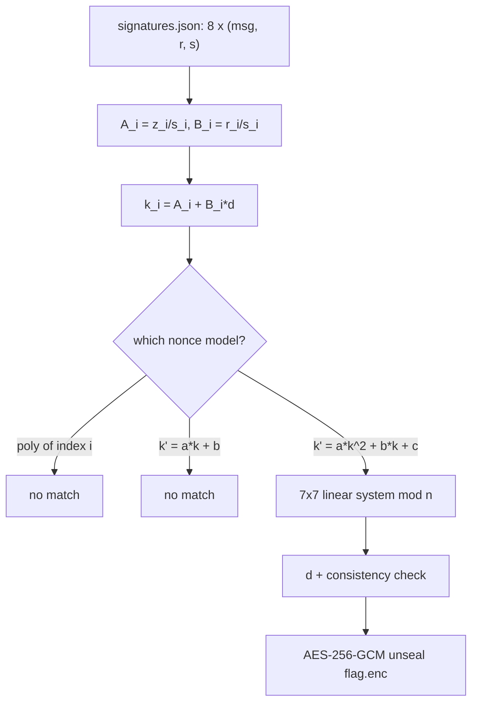

# Polynonce

## Overview

| | |
|---|---|
| **Event** | H7CTF 2026 Quals |
| **Category** | Crypto |
| **Difficulty** | Hard |

!!! info "Challenge Description"
    Aurum's treasury signer rubber-stamps transfers by the batch, day in and day out. The engineer who wired it up cut a corner to keep the queue moving, then quietly left the company.

    The corner he cut is still signing every approval.

    HTTP 443: `https://$HOST`

It's tagged as a Docker challenge, but there were no local files. The instance is just a tiny page that links two static files:

```html
<h1>Aurum treasury signer</h1><p>Recovered approvals for offline review:</p><ul><li><a href="signatures.json">signatures.json</a></li><li><a href="flag.enc">flag.enc</a></li></ul>
```

`flag.enc` is the AES-256-GCM ciphertext (59 bytes). The goal is getting the key to open it.

## Recon

`signatures.json` has the curve and hash info, the signer's public key, and 8 ECDSA signatures over distinct treasury approval messages. The top of the file tells you exactly how everything is derived:

```json
{
  "curve": "secp256k1",
  "hash": "sha256",
  "z": "z = int.from_bytes(sha256(msg), 'big')  (no reduction)",
  "sealed_flag": "AES-256-GCM, key=SHA256(d_be32), iv=SHA256('Qx,Qy')[:12], flag.enc = ct||tag16",
  "pubkey": {
    "x": "82844204148873628703996834703464161140806186313179041871201342360148464197968",
    "y": "82182622956164716681646606429624519841352969485355936171064060467128106035122"
  },
```

The 8 signed messages, in file order:

```text
TRANSFER 12.5 BTC -> treasury cold wallet 0x9f2a
TRANSFER 0.4 BTC -> ops petty cash 0x51bb
APPROVE quarterly audit report Q3-2026
TRANSFER 3.0 BTC -> vendor settlement 0xc417
ROTATE signing epoch 7 -> 8
TRANSFER 88.0 BTC -> escrow 0x2d90
APPROVE firmware manifest v4.2.1
TRANSFER 1.25 BTC -> payroll batch 0x77ee
```

The AES key is `SHA256(d)` and the IV only depends on the public key, so the whole challenge is recovering the private key \(d\) from these 8 signatures. Everything I needed was in the two downloaded files, so I never had to talk to the service at all.

## The vulnerability

The challenge name is a pretty direct pointer to the PolyNonce attack (Macchetti, Kudelski Security, 2023).[^polynonce] The idea is that a broken signer doesn't draw a fresh random nonce \(k\) per signature. It derives each nonce from the previous one with a fixed, low degree polynomial recurrence with unknown coefficients, something like \(k_{i+1} = a k_i + b\) or \(k_{i+1} = a k_i^2 + b k_i + c \pmod n\). That fits the description's "cut a corner to keep the queue moving": it's deterministic and fast, and every individual \(r\) still comes out different, so nothing looks wrong at a glance.

The reason it breaks is that the ECDSA signing equation \(s = k^{-1}(z + r d) \bmod n\) rearranges to:

\[k_i = A_i + B_i d \pmod n, \qquad A_i = z_i s_i^{-1} \bmod n, \qquad B_i = r_i s_i^{-1} \bmod n\]

\(A_i\) and \(B_i\) come straight from public data, so every nonce is an affine function of \(d\). Plug that into whatever relation the nonces are supposed to satisfy and you get equations in \(d\) plus the recurrence's own unknown coefficients. As long as the degree stays small, you can treat every product of unknowns (like \(a d\), \(b d\), \(a d^2\)) as its own new variable. Then the system is exactly linear mod the prime group order \(n\) and plain Gaussian elimination solves it. No lattice needed once there are enough signatures.

Here's the whole chain:



## Stage 1: trying the simple models first

I went through candidate nonce models in order of increasing complexity. Since some of these systems have as many unknowns as equations, a solve will always spit out *some* answer, so I checked each candidate against held out signatures that weren't used in the fit.

1. **\(k_i\) as a low degree polynomial of the batch index \(i\)** (\(k_i = c_0 + c_1 i + \dots + c_D i^D\)). This one is linear in \(d, c_0, \dots, c_D\) directly, since \(B_i d - \sum_j c_j i^j \equiv -A_i\). I tried degrees 0 to 5 with at least one signature held out each time. None matched.
2. **Linear recurrence on the previous nonce** (\(k_{i+1} = a k_i + b\), the textbook LCG case). Linearizing with \(x = a d\) gives 4 unknowns (\(d, x, a, b\)). I fit on 4 pairs and checked against the remaining 3. Didn't match either.
3. **Quadratic recurrence on the previous nonce** (\(k_{i+1} = a k_i^2 + b k_i + c\)). This is the one that hit.

For reference, the LCG attempt from `solve.py`:

```python title="solve.py (excerpt)"
def try_lcg(A, B):
    """k_{i+1} = a*k_i + b (mod n). Linearize with x = a*d:
       B_{i+1}*d - B_i*x - A_i*a - b == -A_{i+1}   (mod n)   [4 unknowns: d, x, a, b]
    Fit on the first 4 pairs, then independently validate the resulting d by
    checking the *actual* k_i sequence follows some single LCG for ALL pairs."""
    n_sigs = len(A)
    pairs = [(i, i + 1) for i in range(n_sigs - 1)]
    if len(pairs) < 4:
        return None
    M, y = [], []
    for (i, j) in pairs[:4]:
        M.append([B[j], (-B[i]) % N, (-A[i]) % N, -1 % N])
        y.append((-A[j]) % N)
    sol = solve_linear_mod(M, y, N)
    if sol is None:
        return None
    d = sol[0]
    k = [(A[i] + B[i] * d) % N for i in range(n_sigs)]
    # derive (a,b) from the first pair, verify against ALL remaining pairs
    if k[1] == k[0]:
        return None
    # k1 = a*k0+b, k2 = a*k1+b -> a = (k2-k1)/(k1-k0)
    a = ((k[2] - k[1]) * modinv((k[1] - k[0]) % N)) % N
    b = (k[1] - a * k[0]) % N
    for (i, j) in pairs:
        if (a * k[i] + b) % N != k[j]:
            return None
    return d, a, b
```

## Stage 2: the quadratic recurrence

Substitute \(k_i = A_i + B_i d\) and \(k_i^2 = A_i^2 + 2 A_i B_i d + B_i^2 d^2\) into \(k_{i+1} = a k_i^2 + b k_i + c\), then group the terms by which products of unknowns show up. Each consecutive pair \((i, i+1)\) gives:

\[B_{i+1} d - A_i^2 a - A_i b - c - (2 A_i B_i)(a d) - B_i (b d) - B_i^2 (a d^2) \equiv -A_{i+1} \pmod n\]

Treating \(d, a, b, c, Q = a d, R = b d, P2 = a d^2\) as 7 independent linear unknowns gives one equation per pair. 8 signatures means exactly 7 consecutive pairs, which is just enough to solve the 7x7 system exactly with modular Gaussian elimination. \(n\) is prime, so it's all exact, no floating point.

```python title="solve.py (excerpt)"
    # unknown order: d, a, b, c, Q, R, P2
    M, y = [], []
    for (i, j) in pairs[:7]:
        row = [
            B[j] % N,
            (-(A[i] * A[i])) % N,
            (-A[i]) % N,
            (-1) % N,
            (-(2 * A[i] * B[i])) % N,
            (-B[i]) % N,
            (-(B[i] * B[i])) % N,
        ]
        M.append(row)
        y.append((-A[j]) % N)
    sol = solve_linear_mod(M, y, N)
    if sol is None:
        return None
    d, a, b, c, Q, R, P2 = sol
    if Q != (a * d) % N:
        return None
    if R != (b * d) % N:
        return None
    if P2 != (a * d * d) % N:
        return None
    return d, a, b, c
```

The catch is that there's no signature left over to hold out, so I had to validate it a different way. The linear solve never enforces the relationships between the product variables and the primary ones, so I checked them after the fact: \(Q = a d\), \(R = b d\) and \(P2 = a d^2\) (mod \(n\)). All three held exactly. Satisfying those by accident would be astronomically unlikely, so that's strong independent confirmation.

That gives the private key directly:

```text
d = 38777567769244238539213321518098770560743901963610550632259368812131859354034
```

## Stage 3: unsealing the flag

Following the spec from `signatures.json`:

```python
key = SHA256(d.to_bytes(32, "big"))
iv  = SHA256(f"{Qx},{Qy}".encode())[:12]
ct, tag = flag_enc[:-16], flag_enc[-16:]
flag = AES.new(key, AES.MODE_GCM, nonce=iv).decrypt_and_verify(ct, tag)
```

The full `solve.py` does all of it in one go: the three nonce models, the modular linear solver and the AES-GCM unseal. One thing to note is that the final script checks the LCG model first, then the quadratic, then the index polynomials, which isn't the order I tried them in. Running it:

```console
$ python solve.py
[+] found consistent quadratic-nonce solution: k_(i+1) = 11382770581900951582759572968035363583277730425120362482570037791427041762956*k_i^2 + 74312909561341734046860221848141557722553378123923901218825974791425703713279*k_i + 3983032261160503883004122585640366545788497601771474650842098371932840996005 (mod n)
    d = 38777567769244238539213321518098770560743901963610550632259368812131859354034
FLAG: H7CTF{6d746428-2c51-4644-8613-2350d24f46dd}
```

## Flag

!!! success "Flag"
    ```text
    H7CTF{6d746428-2c51-4644-8613-2350d24f46dd}
    ```

## Notes

- PolyNonce is a specific, real attack. If you recognize the name you can go straight to the paper's construction instead of guessing at a generic related nonce attack.
- The general trick (write \(k_i\) as an affine function of \(d\), substitute into whatever relation the nonces are meant to follow, and linearize every unknown product as its own variable) scales to any polynomial degree recurrence. The cost is needing roughly \(2 \cdot \text{degree}\) unknowns and that many signatures. Still worth trying the cheap models (static, or polynomial in the index) before reaching for the quadratic one.
- Always validate against something the fit didn't see. That's either held out signatures, or when every signature is needed just to pin down the unknowns, the internal consistency of the product variables you introduced. Either check turns "the linear solve returned some answer" into "this answer is almost certainly right".
- This was fully solvable offline from two downloaded files. Worth checking whether a "Docker" challenge even needs the live service before scripting network interaction.

## References

[^polynonce]: Macchetti, PolyNonce attack, Kudelski Security, 2023, IACR ePrint 2023/305: <https://eprint.iacr.org/2023/305>
