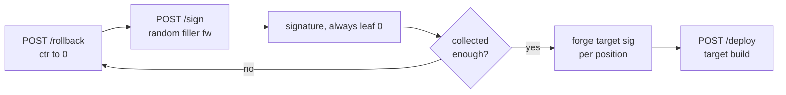

# Take Two

## Overview

| | |
|---|---|
| **Event** | H7CTF 2026 Quals |
| **Category** | Crypto |
| **Difficulty** | Hard |

!!! info "Challenge Description"
    Helios firmware boots only with the notary's blessing, and the notary blesses only the builds it trusts. The one you have in mind will never make that list.

    Lucky for you, it is not above a second take.

    File: `lms.py`

    HTTP 443: `https://$HOST`

I got `lms.py` (the signer the server uses) and a live instance. The goal is to get the device to accept a firmware build the notary would never sign, which from the description is going to be a build with `BACKDOOR` in the name.

## Recon

`GET /` on the instance describes itself:

```json
{
  "service": "Helios firmware notary",
  "root": "f4926b8c5ad1aed2c239b2d26e8fb24191c35a9c206a6332f0a507c49c9b1810",
  "scheme": "LMS/WOTS+ (see lms.py); each leaf signs once",
  "endpoints": {
    "GET /root": "device trust anchor (Merkle root)",
    "POST /sign {firmware}": "notarize a benign firmware build (backdoored builds refused)",
    "POST /rollback": "maintenance: revert the signing counter",
    "POST /deploy {firmware, sig}": "device update; boots any firmware that verifies against the root"
  },
  "note": "a build containing 'BACKDOOR' will not be signed"
}
```

So `/sign` will sign anything except the one build I actually want, `/deploy` boots anything that verifies against the root, and then there's `/rollback`. "Each leaf signs once", an endpoint that reverts the signing counter, and a challenge called Take Two. Pretty obvious where this is going.

The comment at the top of `lms.py` says it out loud too:

```python
# a compact LMS-style hash-based signature: WOTS one-time leaves under a Merkle
# tree (RFC 8554 in spirit, self-consistent hashing). this is the signer the
# firmware server uses; it is shipped so the scheme is known. the vulnerability
# is operational (a leaf reused via a counter reset), not in this code.
```

The scheme is modelled on LMS, the Leighton-Micali hash-based signatures from RFC 8554,[^rfc8554] which NIST approved for things like firmware signing in SP 800-208.[^sp800208] Both documents hammer the same point. These schemes are stateful, and if a one-time key ever signs two different messages the security falls apart. People have studied exactly how much a WOTS key loses after a second signature,[^oops] and how state management goes wrong in real deployments with backups, VM clones and restarted processes.[^statemgmt] Here the server just gives me the reset button, so I didn't need anything clever from those papers. I just needed to understand the chains well enough to forge.

## Background: how this signature works

### Hash chains

Everything is built on one function in `lms.py`:

```python
def chain(x, steps):
    for _ in range(steps):
        x = H(x)     # H = sha256
    return x
```

Hash `x` with SHA-256, `steps` times. Anyone can walk a chain forward. Walking it backward means inverting SHA-256, which nobody can do. That one-way-ness is what the whole attack plays with.

### Winternitz one-time signatures (WOTS)

The parameters: `N = 32` (SHA-256 output size), `W = 16` (so digits are 4 bits, 0 to 15), and `LEN = 67`. That 67 is `64 + 3`: the 256-bit message hash splits into 64 nibbles, plus 3 checksum digits.

A single leaf's secret key is 67 random 32-byte values, one per digit position. To sign a message:

```python
def msg_digits(msg):
    d = H(msg)
    digs = []
    for byte in d:
        digs.append(byte >> 4)     # high nibble
        digs.append(byte & 0xF)    # low nibble
    c = sum(W - 1 - x for x in digs)              # winternitz checksum
    digs += [(c >> 8) & 0xF, (c >> 4) & 0xF, c & 0xF]
    return digs                                    # length 67

def wots_sign(sk, msg):
    return [chain(sk[i], d) for i, d in enumerate(msg_digits(msg))]
```

For each position `i`, take that position's secret `sk[i]` and hash it forward `d_i` times, where `d_i` is the message digit there. The signature is those 67 chained values. To verify, you walk each chain the rest of the way to the top (`W - 1 - d_i` more hashes) and check the result reconstructs the leaf's public key:

```python
def wots_pk_from_sig(msg, sig):
    return H(b"".join(chain(sig[i], W - 1 - d) for i, d in enumerate(msg_digits(msg))))
```

### Why the checksum exists

If it were just the 64 message digits, forging would be easy. Every revealed value is `chain(sk_i, d_i)`, and since anyone can hash forward, I could bump any digit *up* for free. The checksum `c = sum(15 - d_i)` is there to stop that. Raise any message digit and the checksum drops, which pushes at least one checksum digit *down*, and going down a chain means inverting the hash. With one signature you can't forge a different message. That's the "one-time" guarantee.

### The Merkle tree on top

WOTS signs one message per key, so `lms.py` builds 16 of these one-time leaves (`TREE_H = 4`) and hashes them up into a Merkle tree. The device only trusts the single root:

```
f4926b8c5ad1aed2c239b2d26e8fb24191c35a9c206a6332f0a507c49c9b1810
```

A full signature is `{leaf, wots, path}`: which leaf signed, the 67 WOTS chain values, and the authentication path of sibling hashes proving that leaf belongs under the root. The `Signer` keeps a counter and bumps it each time so every leaf signs once:

```python
def sign(self, msg, leaf=None):
    q = self.ctr if leaf is None else leaf
    sig = {"leaf": q, "wots": wots_sign(self.sk[q], msg),
           "path": auth_path(self.levels, q)}
    if leaf is None:
        self.ctr += 1
    return sig
```

The cryptography here is fine. The bug is that `/rollback` sets `self.ctr` back down.

## The vulnerability: one key, many signatures

The "one-time" safety depends on a leaf signing exactly one message. Sign a second message with the same leaf and the checksum stops helping, because now I can *choose* which of two revealed values to extend at each position.

At position `i`, if I have a signature for a message whose digit there is `s`, I hold `chain(sk_i, s)`. For any target digit `t >= s`, I can compute `chain(sk_i, t)` myself by hashing `(t - s)` more times. No secret needed, it's just more `chain()` on a value I already have. The only positions I can't reach are the ones where the target digit is *below* every digit I've seen, since that would mean walking a chain backward.

So the plan is to collect many signatures under one leaf, for messages I pick, and at every one of the 67 positions I get a growing pile of `(digit, chain value)` samples. For the real target, at each position I pick whichever sample has a digit at or below the target digit and extend it forward. As long as *some* sample sits low enough at every position, the whole forged signature assembles, checksum digits included, and it verifies against the untouched root.

`/rollback` is what makes "many signatures under one leaf" possible. Every call puts the counter back to 0, so the next `/sign` signs under leaf 0 again. Repeat and I get arbitrarily many leaf-0 signatures for whatever benign filler messages I want.



## Collecting samples

The loop is rollback, sign, record, repeat. Every response came back with `sig.leaf == 0`, so the reset was doing what I thought:

```python
def gather(n):
    samples = []
    for i in range(n):
        rollback()                          # POST /rollback, ctr -> 0
        fw = rand_fw()                       # "fw-" + 24 random chars, benign
        sig = sign(fw)["sig"]                # POST /sign
        assert sig["leaf"] == 0
        digs = msg_digits(fw.encode())       # recompute the digits locally
        samples.append((digs, sig["wots"], sig["path"]))
    return samples
```

I recompute each filler's digits locally with `lms.py`'s own `msg_digits`, so I know exactly which digit sits behind each revealed chain value. The auth `path` for leaf 0 never changes, so I just keep one copy of it for later.

### How many samples

The 64 message digits are nibbles of a SHA-256 digest, so they are basically uniform over 0 to 15. A position is only a problem if the target digit there is low and no sample ever came in at or below it. Worst case is a target digit of 0, which needs an exact 0 from some sample, probability `1/16` each. Over `K` samples the chance a given zero-target position is never covered is `(15/16)^K`, which at `K = 300` is about `7e-9`.

The 3 checksum digits don't follow that rule. The checksum is `sum(15 - d_i)` over 64 digits, so it sits around 480 and its top digit (`c >> 8`) is almost always 1 or 2. Those positions just have a narrow range instead of a uniform one, and for them what matters is how the target's checksum digits compare with typical samples.

For the actual target, `BACKDOOR unlock console v1`, the digits work out like this (checked afterwards by running `msg_digits` from `lms.py`):

| | |
|---|---|
| Message positions with target digit 0 | 3 (positions 7, 51, 61) |
| Checksum digits | `1, 12, 4` |

The top checksum digit being 1 means I need at least one sample whose checksum is under 512, which is common. Simulating the collection offline with `lms.py` and random filler builds, a full set of covering samples usually shows up after about 25 signatures, and in 200 runs the worst case needed 110. So 300 was comfortable overkill. I ran 300.

## Forging the target

Target firmware: `BACKDOOR unlock console v1`. Compute its 67 digits, then for each position pick the best available sample (the largest source digit still `<=` the target digit, so I extend the shortest distance) and hash it forward to the target digit:

```python
def forge(samples, target_fw):
    target_digits = msg_digits(target_fw.encode())
    path = samples[0][2]                     # any leaf-0 auth path, unchanged
    forged = []
    for i in range(LEN):
        td = target_digits[i]
        best = None                          # (source_digit, chain_value_hex)
        for digs, wots, _ in samples:
            sd = digs[i]
            if sd <= td and (best is None or sd > best[0]):
                best = (sd, wots[i])
        if best is None:
            raise RuntimeError(f"position {i}: no sample <= {td}; gather more")
        sd, hexval = best
        x = chain(bytes.fromhex(hexval), td - sd)     # extend forward
        forged.append(x.hex())
    return {"leaf": 0, "wots": forged, "path": path}
```

That covers the checksum positions for free, because they are just three more digit positions in the same list and the same "find a sample at or below, extend forward" rule applies. There is no separate step for them.

## Deploying it

Assemble `{"leaf": 0, "wots": forged, "path": <leaf-0 path>}` and POST it to `/deploy` with the target firmware. The server recomputes the leaf public key from my forged chains, walks the auth path to the root, sees it match, and boots:

```json
{"ok": true, "booted": true, "flag": "H7CTF{8bea917d-e072-4e3d-86c8-c31f78d202a2}"}
```

The honest `/sign` was never asked to sign the target build. I rebuilt its signature out of pieces of 300 signatures for completely benign builds.

## Cleaning it up

The final `solve.py` is those three pieces stitched together. `gather(300)` does rollback-then-sign, `forge()` does the per-position extension, and `deploy()` sends it. It imports `chain`, `msg_digits` and `LEN` straight from the challenge's `lms.py`, so I never reimplemented the scheme and couldn't get it subtly wrong. The forge uses the same functions the verifier does.

## Notes

- Stateful hash-based signatures (WOTS, LMS, XMSS) are only as safe as their state management. The code can be completely correct, like the challenge comment says, and still be broken by anything that lets one leaf sign twice. A counter reset, a restored VM snapshot, a process that restarts and forgets its state. RFC 8554 and NIST SP 800-208 both warn about this, and SP 800-208 wants the keys and state kept in hardware that won't export them, so a "maintenance rollback" like this can't happen.
- You don't need exactly two signatures. Every extra signature under the same key is another sample at every position, and you keep whichever one is most useful per position. More samples, more coverage.
- No attack on SHA-256 itself was involved. It's just collect, then hash forward. Cheap, and fully deterministic once there are enough samples.

## References

[^rfc8554]: D. McGrew, M. Curcio, S. Fluhrer, "Leighton-Micali Hash-Based Signatures," RFC 8554, April 2019: <https://www.rfc-editor.org/rfc/rfc8554.html>
[^sp800208]: NIST, "Recommendation for Stateful Hash-Based Signature Schemes," SP 800-208, October 2020: <https://csrc.nist.gov/pubs/sp/800/208/final>
[^oops]: L. Groot Bruinderink, A. Hülsing, "'Oops, I did it again' - Security of One-Time Signatures under Two-Message Attacks," SAC 2017 (ePrint 2016/1042): <https://eprint.iacr.org/2016/1042>
[^statemgmt]: D. McGrew, P. Kampanakis, S. Fluhrer, S.-L. Gazdag, D. Butin, J. Buchmann, "State Management for Hash-Based Signatures," SSR 2016 (ePrint 2016/357): <https://eprint.iacr.org/2016/357>
