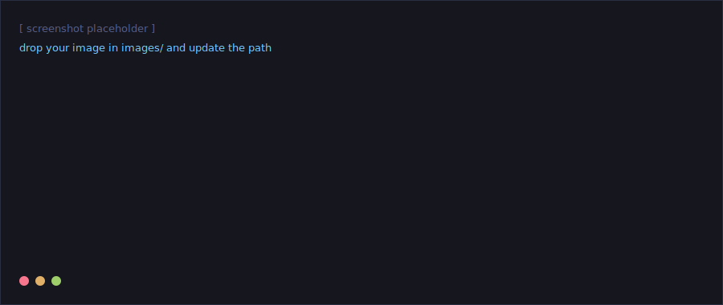
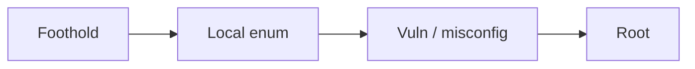

---
tags:
  - linux
  - web
  - privesc
---

# [ Box / Machine Name ]

| | |
|---|---|
| **Platform** | [HTB / THM / other] |
| **OS** | [Linux / Windows] |
| **Difficulty** | [Easy / Medium / Hard] |
| **Date** | [YYYY-MM-DD] |
| **Tags** | `web` · `enumeration` · `privesc` |

!!! abstract "TL;DR"
    [ One or two sentences summarising the path: how you got a foothold and how you escalated. Replace this. ]

## Overview

[ Short intro to the target and your approach. Placeholder paragraph — replace with your own words. ]

## Recon

[ Describe the initial scan and what stood out. ]

A titled code block (the label-bar style) for commands you ran:

```bash title="recon.sh"
nmap -sV -sC -oN nmap/initial.txt [TARGET_IP]
```

A terminal session — note the `$` prompt is highlighted and output is dimmed:

```console
$ nmap -sV [TARGET_IP]
PORT     STATE  SERVICE  VERSION
22/tcp   open   ssh      [service/version]
80/tcp   open   http     [service/version]
$ # [ your notes on the results ]
```

## Enumeration

[ Placeholder. ] Below is a screenshot placeholder so you can see how images sit in a page:

{ width="100%" }

You can split parallel approaches into tabs:

=== "Manual"

    ```bash
    [ command for the manual route ]
    ```

=== "Automated"

    ```bash
    [ command for the tooling route ]
    ```

## Initial Foothold

[ How you got your first shell. ]

!!! note "Credential / payload"
    ```text
    [ paste the payload, request, or creds here ]
    ```

## Privilege Escalation

[ The path from low-priv user to root/SYSTEM. ]

A diagram of the attack path (Mermaid — edit the nodes):



## Root

!!! success "Flag"
    ```text
    [ root flag or proof here ]
    ```

## Lessons / Beyond Root

- [ Takeaway one ]
- [ Takeaway two ]
